# 개발일지 (2026-09-08)

## 어제까지 진행 상황
- Interface View 2종(`ZI_B07_EKKO`/`ZI_B07_EKPO`), Root View(`ZR_B07_EKKO`), 헤더 Projection View(`ZC_B07_EKKO`)까지 완료.
- 아이템 Projection(`ZC_B07_EKPO`)은 미생성 상태로 남아 있었음 — `ZC_B07_EKKO`의 `_Ekpo`는 우선 `redirected to composition child` 구문 없이 액티브만 해 둔 상태.

## 오늘 목표
- `ZC_B07_EKPO` 생성 및 헤더-아이템 간 redirect 실제 연결.
- MDE/BDEF/UI 구성까지 마무리하고 테스트 진행.

## RAP 개발 — 06 구매오더

### Projection View — ZC_B07_EKPO 생성
`ZI_B07_EKPO`를 기준으로 아이템 Projection View를 신규 생성함. 기본 어노테이션(`@AccessControl.authorizationCheck`, `@Metadata.ignorePropagatedAnnotations`, `@Metadata.allowExtensions`)을 추가하고 키 필드(`EbelnUuid`/`Ebelp`)부터 시작함.

자재유형/G·L계정/통화 텍스트 Association을 처음에는 Projection View에 직접 작성하려 했으나 오류가 발생함. Association 정의 자체는 Interface View(`ZI_B07_EKPO`)에서 해야 하고, Projection View에서는 `_MtartText.MaterialTypeName as MtartText`처럼 필드 재구성 형태로만 텍스트를 끌어올 수 있음을 확인함(헤더 때 확인한 "Association 정의는 Interface/Root에서" 규칙과 동일한 패턴). 이에 따라 `_MtartText`/`_SaknrText`/`_WaersText` Association 3종을 `ZI_B07_EKPO`에 추가함.

관련 오브젝트: [`ZI_B07_EKPO`](../../reference/06_purchase-order.md) · [코드 보기](../../src/06_purchase-order/cds/ZI_B07_EKPO.ddls.asddls)

헤더-아이템 간 Value Help 연결을 위해 `_Ekko.LifUuid as HeaderLifUuid`(공급업체 UUID를 Value Help 필터로만 사용, 화면 비노출은 MDE에서 처리)를 추가하고, 플랜트→저장위치, 플랜트+공급업체→구매정보번호처럼 상위 필드에 종속되는 Value Help는 `additionalBinding`의 `localElement`/`usage: #FILTER`로 연결함.

### 신규 Search Help 7종
아이템 Projection에 필요한 Value Help 중 미생성 상태였던 항목들을 이 김에 함께 생성함. 모두 기존 관례대로 `src/00_common-searchhelp/cds/`에 둠.

- **`ZI_B07_INFNR_F4`(구매정보레코드 번호)**: `ZI_B07_EINA`/`ZI_B07_EINE`/`ZR_B07_MARA` 조인. 플랜트/공급업체 Additional Binding 필터의 대상 엔티티. 서치헬프가 없는 상태로 화면을 먼저 확인했다가 미생성 상태임을 알아채고 이 김에 생성함.

  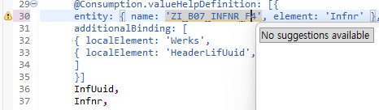
  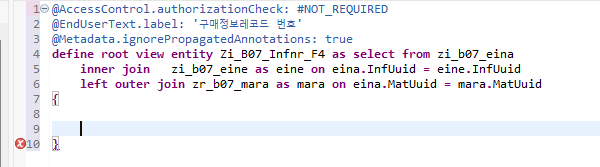
- **`ZI_B07_INSMK_F4`(재고유형)**: `I_DomainFixedValueText`, 도메인 `MB_INSMK`.
- **`ZI_B07_MWSKZ_F4`(세금코드)**: `T001`/`T005`/`T007A`/`T007S` 조인으로 회사코드 기준 필터링.
- **`ZI_B07_POSTAT_F4`(구매오더 상태)**: `I_DomainFixedValueText`, 도메인 `ZDB07POSTAT`.
- **`ZI_B07_EBELN_F4`(구매오더번호)**: `ZTB07EKKO` 단순 조회.
- **`ZI_B07_EPSTP_F4`(품목범주)**: 아래 시행착오 참고.
- **`ZI_B07_KNTTP_F4`(계정지정범주)**: `T163K`(계정지정범주-품목범주 허용 매핑)와 `T163I`(계정지정범주 텍스트) 조인.

FS 요구사항(검색조건은 구매오더일/공급업체/구매오더번호 3개, 공급업체만 Value Help 적용)에는 없는 추가 구현이지만, Object Page 필드들의 사용성을 위해 함께 만듦.

관련 오브젝트: [공통 Search Help](../../reference/00_common-searchhelp.md)

### EPSTP(품목범주) Search Help 구성 — 시행착오 기록
품목범주(EPSTP) 필드는 소스 테이블을 특정하기 어려워 아래 순서로 확인함.

1. `I_DomainFixedValueText` + 도메인 `PSTYP` 기준으로 시도 → 데이터 미출력. SE11에서 `PSTYP` 도메인 자체에 Fixed Value가 없음을 확인.
2. 체크테이블 `T163`(Item Categories in Purchasing Document) 기반으로 전환 시도 → SE11에서 필드 구조 확인 결과 텍스트 필드가 없어 서치헬프 구성 불가.
3. ME21N 화면에서 F1 → 기술정보로 실제 연결된 서치헬프를 직접 확인 → "Subitem Category"(`UPTYP`, BOM 서브아이템 유형) F4가 확인됨. `PSTYP`과는 다른 필드로 판명.
4. Item Overview ALV 컬럼 설정에서 기술 필드명(`PSTYP`) 기준으로 검색 → "Account Assignment Category"(`KNTTP`, 17개 값)와 "Product Type Group"(1=Material/2=Service)이 확인됨. 둘 다 `PSTYP`은 아니었음(단, `KNTTP` 값/텍스트 확인에는 활용).
5. PO 문서유형(`BSART`) 드롭다운과 개념을 혼동해 잘못된 `PSTYP` 표준값 목록을 제시했다가, `BSART`와 `PSTYP` 개념이 섞인 오류로 확인되어 폐기.
6. Item Overview 그리드 내 계정지정범주(A) 컬럼 옆의 좁은 "I" 컬럼을 직접 발견 → F4 실행 결과 "Text for Item Cat." 서치헬프에서 실제 값 10개 확인(공백=Standard, B=Limit, K=Consignment, L=Subcontracting, S=Third-party, T=Text, D=Service, E=Enhanced Limit, C=Stock prov. by cust., P=Return trans. pack.).
7. F1 → Performance Assistant 공식 문서("Item Category in Purchasing Document") 확인 → 개념 설명과 카테고리 종류는 확인했으나 정확한 코드-값 매핑이나 출처 테이블은 문서만으로 특정 불가.
8. `/h`로 디버거 강제 진입 후 ME21N에서 EPSTP 필드 F4 실행 → 콜스택 추적 시작(`FIELD mepo1211-epstp MODULE event_pov_list`부터).
9. Step Into로 `SAPLMEGUI event_pov_list` → `CL_FRAMEWORK_MM`/`CL_TABLE_VIEW_MM`/`CL_MODEL_VIEW_MM`의 `handle_event`/`pov`/`pov_list` 체인을 통과.
10. 콜스택 최상단에서 `SAPLMMF4 help_values_epstp` — `HELP_VALUES_EPSTP` 함수모듈 확인.
11. `HELP_VALUES_EPSTP` 소스 확인 → 내부적으로 `T163Y`(품목범주 텍스트: `EPSTP`+`PTEXT`+`SPRAS`)와 `T161P`(품목범주-문서유형 허용 매핑: `PSTYP`+`BSTYP`+`BSART`)를 조합해 값을 구성함을 확인. 화면의 문서유형에 따라 `T161P`로 허용된 품목범주만 `T163Y`에서 걸러 보여주는 구조.
12. 최종적으로 `EPSTP`는 도메인 Fixed Value도 단일 체크테이블도 아니고 `T163Y`가 실제 텍스트 소스 테이블임을 확인, 하드코딩 없이 `T163Y` 기반 CDS로 구성함.

관련 오브젝트: [`ZI_B07_EPSTP_F4`](../../reference/00_common-searchhelp.md) · [코드 보기](../../src/00_common-searchhelp/cds/ZI_B07_EPSTP_F4.ddls.asddls)

### 아이템 Projection 텍스트/서치헬프 연결 및 헤더-아이템 redirect
위 6종 서치헬프에 `ZI_B07_KNTTP_F4`(계정지정범주, `T163K`/`T163I` 조인)를 더해 아이템 Projection의 각 필드에 연결함 — 세금코드/품목범주/재고유형/계정지정범주/구매오더상태에 대해 `_MwskzText`/`_EpstpText`/`_InsmkText`/`_KnttpText`/`_PostatText` Association을 `ZI_B07_EKPO`에 추가하고, `ZC_B07_EKPO`에서 `@Consumption.valueHelpDefinition`과 `@ObjectModel.text.element`로 연결함.

`_MwskzText`의 ON조건이 참조하는 `HeaderBukrs`(헤더 회사코드)는 `HeaderLifUuid`와 마찬가지로 Projection View에서는 Association 선언과 필드 정의가 함께 되지 않아, Interface View(`ZI_B07_EKPO`)에 `_Ekko.Bukrs as HeaderBukrs`로 정의하고 Projection에서는 그대로 끌어다 쓰는 방식으로 처리함.

가장 중요한 작업으로, 어제 만들어 두지 못했던 헤더-아이템 간 redirect를 마무리함. `ZC_B07_EKPO`가 존재하는 상태에서 `_Ekko : redirected to parent ZC_B07_EKKO`를 추가하고 액티브한 뒤, `ZC_B07_EKKO`로 돌아가 `_Ekpo : redirected to composition child ZC_B07_EKPO`의 주석을 해제하고 액티브함.

관련 오브젝트: [`ZC_B07_EKPO`](../../reference/06_purchase-order.md) · [코드 보기](../../src/06_purchase-order/cds/ZC_B07_EKPO.ddls.asddls)

### 헤더 Projection 보완
`ZC_B07_EKKO`에 누락되어 있던 `@Metadata.allowExtensions: true`를 추가함. 구매오더일(Bedat) 필드는 `@Consumption.filter: { selectionType: #SINGLE }`을 적용하면 툴바에 달력 아이콘이 있는 단일 날짜 입력창으로 표시된다는 것을 확인해 반영함. 구매오더번호(Ebeln)에는 신규 생성한 `ZI_B07_EBELN_F4` Value Help를 연결함.

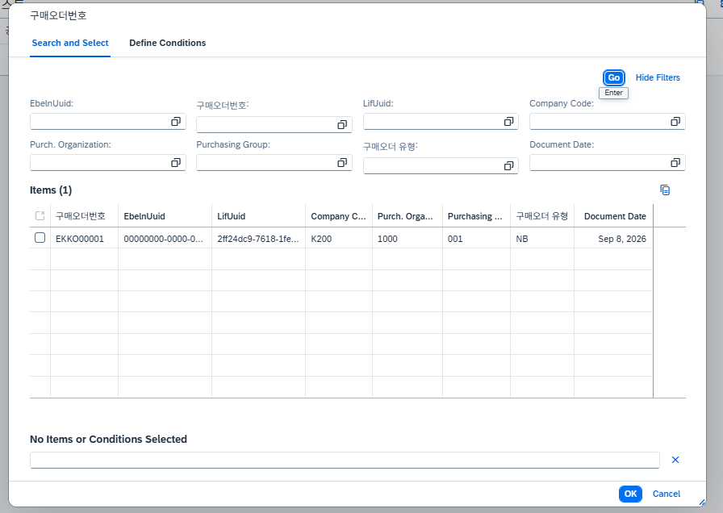
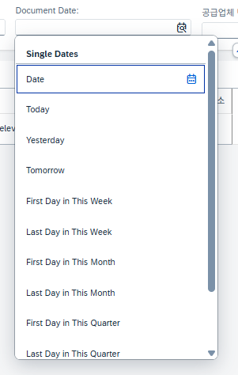
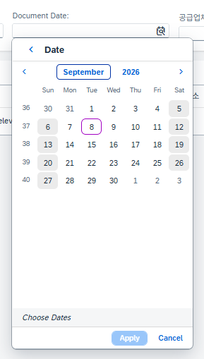

관련 오브젝트: [`ZC_B07_EKKO`](../../reference/06_purchase-order.md) · [코드 보기](../../src/06_purchase-order/cds/ZC_B07_EKKO.ddls.asddls)

### MDE 생성
헤더(`ZC_B07_EKKO`)와 아이템(`ZC_B07_EKPO`) MDE를 각각 생성함. List Report와 Object Page(헤더/아이템) 구성을 반영해 1차 완성함. FS나 스크린샷에 명시되지 않은 필드들은 성격별로 묶어 새 Facet을 만듦.

- 헤더 — 신규 Facet: "구매 조직 정보"(회사코드/구매조직/구매그룹/문서유형), "구매 조건 정보"(지급조건/인코텀즈/조건레코드/참조구매오더 2종).
- 아이템 — 신규 Facet: "가격 및 회계 정보"(총액/현지통화금액/세금코드/계정지정범주/G·L계정/품목범주/구매오더상태), "납기 및 재고 정보"(납기일/선적기한/재고유형/패키지번호).

관련 오브젝트: [`ZC_B07_EKKO`](../../reference/06_purchase-order.md) · [`ZC_B07_EKPO`](../../reference/06_purchase-order.md) · [코드 보기(헤더)](../../src/06_purchase-order/cds/ZC_B07_EKKO.ddlx.asddlx) · [코드 보기(아이템)](../../src/06_purchase-order/cds/ZC_B07_EKPO.ddlx.asddlx)

### Business Service 생성 및 데이터 테스트
`ZUI_B07_EKKO`(Service Definition, 헤더/아이템 둘 다 expose), `ZUI_B07_EKKO_V4`(Service Binding)를 생성함. CRUD/결정/검증 로직이 아직 없는 상태라도 화면 확인을 위해 데이터가 필요해, 헤더 1건·아이템 1건을 직접 입력해 등록함.

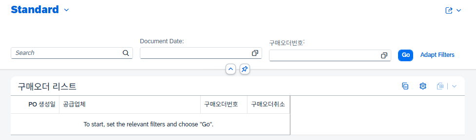
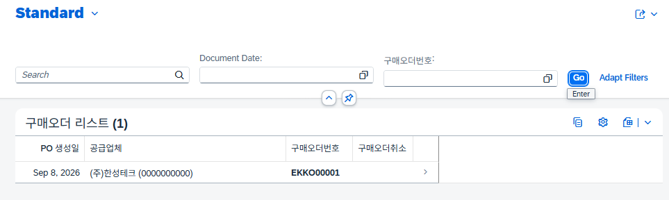

List Report/Object Page에서 Facet과 텍스트 설정이 의도한 대로 표시되는 것을 확인함.

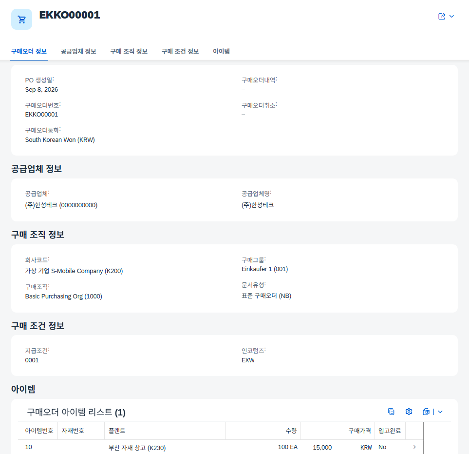
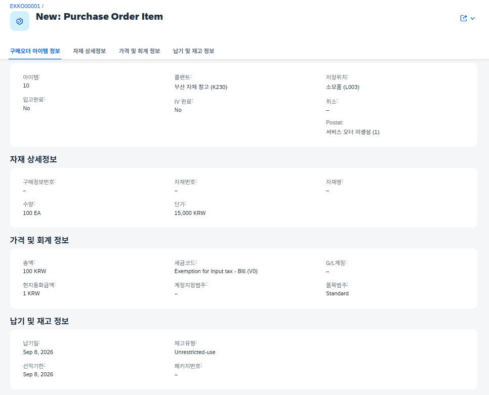

다만 서치헬프 쪽은 BDEF가 완성되어야 제대로 확인 가능할 것으로 예상됨. 우선 List Report의 검색조건(Selection Field)을 확인한 결과 구매오더일/구매오더번호에는 아직 Value Help가 지정되어 있지 않은 상태였음.

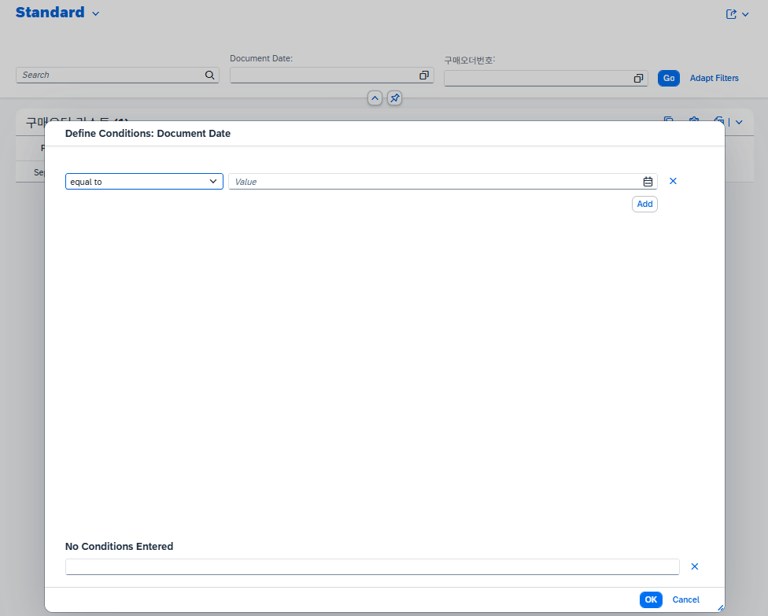
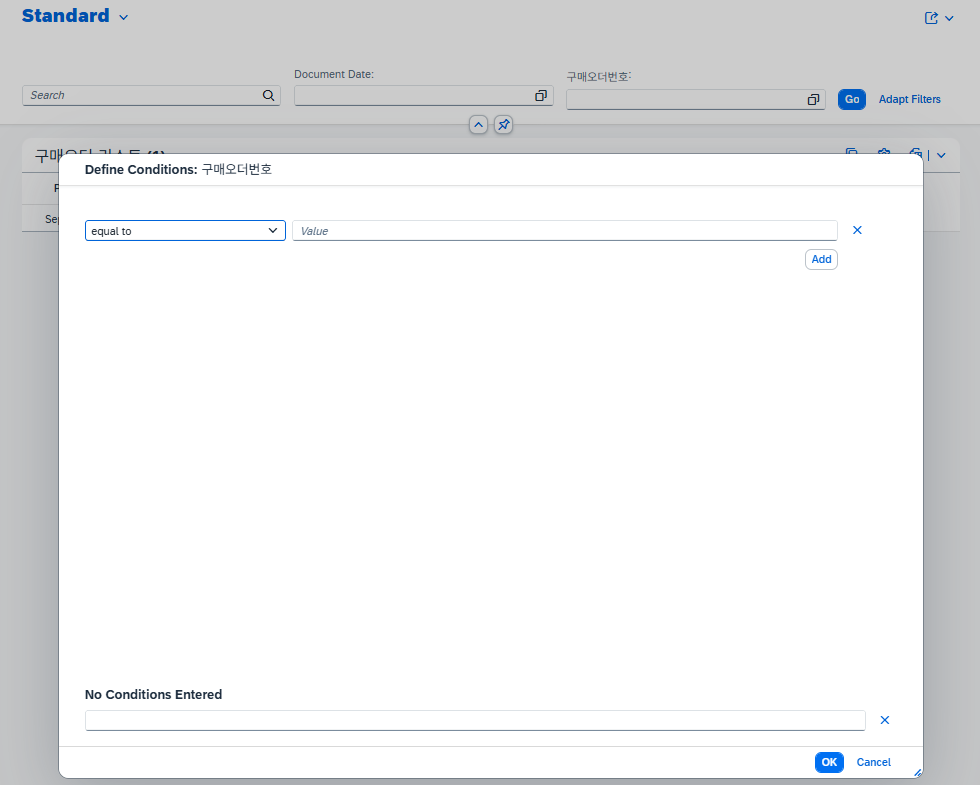

FS 원문(06. 구매오더_FS_v10.pdf, p.9, 3.4절)을 재확인한 결과 List Report 검색조건 기본 노출은 구매오더일/공급업체/구매오더번호 3개이며 Value Help는 공급업체에만 요구됨을 재확인함. 그 외 서치헬프/필터는 요구사항을 넘어선 추가 구현. `ZI_B07_EBELN_F4`를 만들어 구매오더번호에 연결하고 Bedat에 `selectionType: #SINGLE`을 적용한 뒤 다시 확인해 보니, 검색조건이 원래 3개여야 하는데 실제로는 2개(구매오더일/구매오더번호)만 Selection Field로 지정되어 있었음을 발견함 — 공급업체(Lifnr)에 `@UI.selectionField`와 `@Consumption.valueHelpDefinition`(`ZI_B07_LIFNR_F4`), 텍스트(`Name1`)를 추가해 3개로 맞춤.

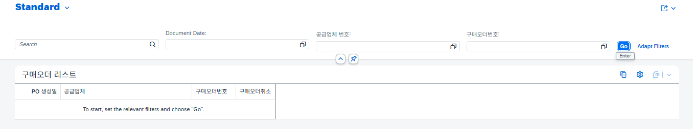
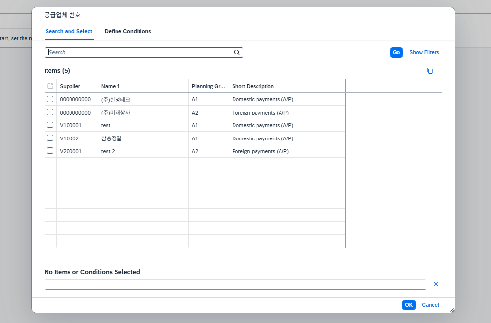

같은 확인 과정에서 `ZC_B07_EKPO`의 `Matnr`/`Infnr` 관련 어노테이션(`@ObjectModel.text.element`, `@UI.textArrangement`, `@Consumption.valueHelpDefinition`)이 실제로는 그 아래에 오는 `MatUuid`/`InfUuid` 필드에 걸려 있고, 정작 `Matnr`/`Infnr` 필드에는 아무 어노테이션도 없는 상태임을 발견해 필드 순서에 맞게 바로잡음.

관련 오브젝트: [`ZUI_B07_EKKO`](../../reference/06_purchase-order.md) · [코드 보기](../../src/06_purchase-order/srv/ZUI_B07_EKKO.srvd.asddls)

### BDEF/BIMP 생성 — Root
`ZR_B07_EKKO`(Managed, with draft)를 생성함. 처음 persistent table을 지정하지 않은 상태로 액티브를 시도해 오류가 발생했고, 이를 계기로 아래 항목들을 순서대로 채워 넣음.

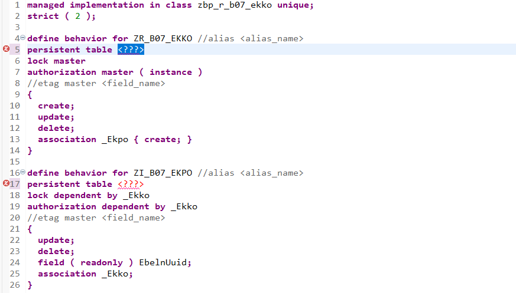

- Persistent/Draft: `persistent table ztb07ekko`/`persistent table ztb07ekpo`, `draft table ztb07ekko_d`/`draft table ztb07ekpo_d`, 둘 다 `with draft;` 필요.
- Etag: 헤더는 `total etag ChangedAt` + `etag master LocChangedAt`, 아이템은 `etag dependent by _Ekko`(부모에 종속).
- 채번: `field ( numbering : managed, readonly ) EbelnUuid;`.
- 매핑: 두 테이블 모두 `mapping for ... corresponding { ... }`로 연결. 아직 필드 컨트롤/결정/검증이 정해지지 않은 필드는 주석 처리한 채로 남겨 둠.
- Draft Action: `Edit`/`Activate`/`Resume`/`Discard`/`Prepare`(전부 헤더에만 필요).

기본 골격을 액티브한 뒤, ADT 퀵픽스로 BIMP 클래스(`zbp_r_b07_ekko`)를 생성함.

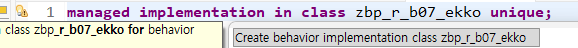

(FS p.4 2.1) `EbelnUuid`는 PK 자동생성, (FS p.10 4.1) 구매오더취소/구매오더통화/구매오더번호는 비활성화 — `field ( readonly ) Ebeln, Waers, Loekz;`로 반영. (FS p.10 4.1) 아이템 생성 시 플랜트는 필수, (FS p.10 4.1) 통화는 헤더 값 표시 후 수정 불가, 입고완료/IV완료/취소는 비활성화 — `field ( mandatory : create, readonly : update ) Werks;` / `field ( readonly ) Waers, Elikz, Erekz, Loekz;`로 반영(단, Waers/Elikz는 아래 테스트(2) 과정에서 Instance Feature로 재조정됨).

Determination:
- `SetHeaderDefaults`(create, PO 생성일=현재일/구매오더통화='KRW', FS p.10 4.1).
- `SetVendorUuid`(create, 공급업체 코드 입력 시 UUID 연결).
- `SetEbelnNumber`(save, `CL_NUMBERRANGE_RUNTIME=>NUMBER_GET`으로 채번, FS p.11 5.2, 넘버레인지 오브젝트 `ZNRB07_EBE`).

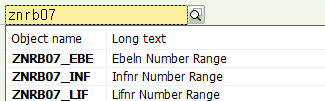

- `SetItemDefaults`(아이템, create, 통화는 헤더 값 상속 — FS p.10 4.1).
- `SetInfoRecordDefault`(아이템, create/update on Infnr·Werks, 구매정보번호 선택 시 자재/수량/단위/단가 자동 표시 — FS p.13 5.2).

Validation `CheckRequired`(save, PO 생성일/공급업체 필수 — FS p.10 4.1, "생성시 필수값은 화면 표시 없이 validation에서만 체크"라는 요구라 mandatory 대신 validation으로 구현)를 추가하고, `draft determine action Prepare { validation CheckRequired; }`로 저장 전 검증이 실제로 동작하도록 연결함.

Instance Feature/Action(FS p.15~16, 저장된 구매오더 삭제는 Object Page의 '구매오더삭제' 버튼으로 삭제플래그를 세우는 방식): 처음에는 `field ( features : instance ) Loekz;`로 시도했으나 `readonly`(고정적 읽기 전용)와 `features:instance`(동적 제어)를 같은 필드에 동시에 지정할 수 없다는 오류가 발생해, `readonly` 목록에서 `Loekz`를 제거함.

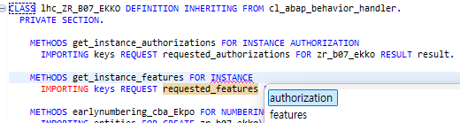

`get_instance_authorizations`을 참고해 `get_instance_features` 메서드를 작성함 — 기존 메서드 선언부를 복사해 Ctrl+Space를 눌러 보니 instance features 관련 키워드 제안이 함께 뜨는 것을 확인함.

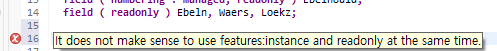

`delete;`에도 `create;`/`update;`처럼 `(features:instance)`를 붙여야 `%delete` 컴포넌트가 생긴다는 것과, 액션도 동일하게 `(features:instance)`를 명시해야 `%action-이름` 컴포넌트가 생긴다는 것을 확인함. 최종적으로 `delete ( features : instance );`, `action ( features : instance ) SetDeletionFlag result [1] $self;`로 구성하고, `SetDeletionFlag` 메서드(Loekz='X' 갱신 후 결과 반환)를 작성함.

### BDEF/BIMP 보완 — Root 추가 Validation/Determination
- `SetVendorUuid`가 이미 있던 로직에 `Name1`(공급업체명)까지 함께 채우도록 보완함(공급업체 UUID뿐 아니라 코드·이름 모두 연결).
- FK 유효성 검증이 필요하다고 판단해 `CheckVendorValid`(공급업체가 존재하고 차단(loevm)되지 않았는지 검증)를 신규 추가함.
- 같은 이유로 `CheckOrgData`(회사코드/구매조직/구매그룹이 각각 `T001`/`T024E`/`T024`에 실제 존재하는지 검증)를 신규 추가함.
- 위 두 Validation도 `draft determine action Prepare`에 함께 등록함.

### BDEF/BIMP 생성 — Item(Ekpo)
- `SetMaterialUuid`(구매정보 레코드 때와 동일하게, PK는 UUID인데 화면에는 코드값이 노출되므로 사용자가 자재코드를 입력하면 UUID를 연결하는 Determination) 신규 추가.
- `CheckRequired`(아이템, save, 플랜트 필수 — FS p.10 4.1)를 헤더 것과 동일한 이름/로직으로 아이템·플랜트 코드에 맞게 재작성.
- `CheckDuplicateItem`(동일 헤더 내 동일 자재 중복 등록 방지)과 `CheckPositiveQty`(수량 양수 체크) 신규 추가.
- FS p.6 (2.3) "입고 진행된 아이템은 임의 삭제 금지"를 반영하기 위해 헤더 때와 동일한 방식으로 Instance Feature를 사용함: `field ( features : instance ) Elikz;` 추가 후, 기존 readonly 목록에서 `Elikz`를 제거(`field ( readonly ) Waers, Erekz, Loekz;`)하고, `get_instance_features`에서 `Elikz = 'X'`인 아이템은 `%delete`를 disabled로 반환하도록 구현.

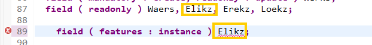

Early Numbering(FS p.5 2.2 "Ebelp(순번)를 복합 키로 사용", FS p.10 4.1 "아이템 순번은 10/20/30으로 자동 증가"): `etag dependent by _Ekko` 아래 `early numbering { ... }`을 추가하고, Root Entity에 별도 Alias가 없으므로 `FOR CREATE zr_b07_ekko\_Ekpo`(원래 Entity명 + Association명)로 지정해야 한다는 것을 확인함. `earlynumbering_create`에서 기존 아이템의 헤더별 최댓값을 조회한 뒤 신규 아이템에 10 단위로 순번을 채번하도록 구현함(`FOR ALL ENTRIES`와 `GROUP BY`를 동시에 쓸 수 없어 전체 조회 후 ABAP에서 헤더별 최댓값을 계산하는 방식 사용). 이 시점의 구현은 아래 테스트(2)에서 드러난 `%is_draft` 매핑 누락으로 이후 한 차례 더 수정됨.

관련 오브젝트: [`ZR_B07_EKKO`](../../reference/06_purchase-order.md) · [코드 보기(BDEF)](../../src/06_purchase-order/bdef/ZR_B07_EKKO.bdef.asbdef) · [코드 보기(BIMP)](../../src/06_purchase-order/bimp/zbp_r_b07_ekko.clas.abap)

### Projection Behavior — ZC_B07_EKKO / ZC_B07_EKPO
Root BDEF와 병행해 Projection BDEF도 구성함. `use create;`/`use update;`/`use delete;`, Draft Action 5종(`Edit`/`Activate`/`Resume`/`Discard`/`Prepare`), `use association _Ekpo { create; with draft; }`를 헤더 쪽에 두고, 아이템 쪽은 `use update;`/`use delete;`/`use association _Ekko { with draft; }`로 구성함. Instance Action `SetDeletionFlag`를 Root에 추가한 뒤 Projection에도 `use action SetDeletionFlag;`를 반영해 최종 완성함.

관련 오브젝트: [`ZC_B07_EKKO`](../../reference/06_purchase-order.md) · [코드 보기](../../src/06_purchase-order/bdef/ZC_B07_EKKO.bdef.asbdef)

---
> 여기까지가 1차 GitHub 반영분. 아래 테스트(2)는 위 구현이 1차로 끝난 뒤, 실제 CRUD 동작 테스트 중 발견/해결한 오류 기록임.

### 🧪 테스트(2) 및 오류 해결
요구사항부터 추가 필드까지 전체 RAP 오브젝트 구현이 1차로 끝난 뒤 실제 동작 테스트를 진행하며 아래 문제들을 순서대로 발견하고 해결함.

**Loekz(구매오더취소)가 체크박스로 표시되지 않음.** 플래그 필드인데도 체크박스가 아니라 일반 입력 필드로 표시됨.

`@UI.defaultValue: ' '`를 시도했으나 이는 생성 화면의 초기값만 지정할 뿐이라 해결되지 않음. Fiori Elements가 필드를 체크박스로 자동 렌더링하는 조건은 OData Edm 타입이 `Edm.Boolean`일 때뿐인데, `Loekz`가 참조하는 도메인(char1, X/공백)은 기본적으로 `Edm.String`으로 노출되어 체크박스가 뜨지 않는 것으로 확인함. Interface View(`ZI_B07_EKKO`)에서 `cast( loekz as abap_boolean preserving type ) as Loekz`로 타입 변환해 해결함(`preserving type` 누락 시 경고가 발생해 함께 추가).

**Pdesc(구매오더내역)에 서치헬프 미적용.** 구매정보레코드에서 썼던 서치헬프를 재사용하면 좋겠다고 판단했으나, 후순위로 미루고 이번 회차에서는 반영하지 않음.

**Ekorg(구매조직) 값이 코드가 아닌 결합 텍스트로 저장되려 함 → 20자 제한 오류.** 구매조직 서치헬프 뷰(`ZI_B07_EKORG_F4`)에서 이미 `@ObjectModel.text.element: ['CombinedText']` + `@UI.textArrangement: #TEXT_FIRST`로 "코드,텍스트" 결합 문자열을 함께 노출하고 있었는데, Projection에서도 텍스트를 같이 띄우려 하자 `Ekorg` 필드의 원래 길이를 초과해 "20자 제한" 오류가 발생함. 숫자로만 입력해도(예: 1000) 동일하게 재현됨.

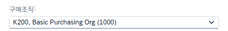
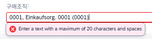
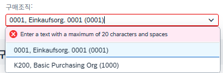
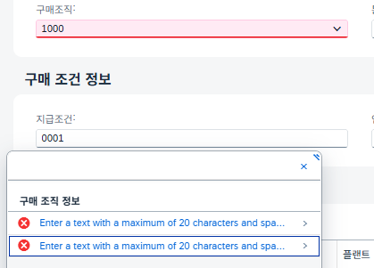

Projection에서 `@ObjectModel.text.element: ['Ekotx']`/`@UI.textArrangement: #TEXT_ONLY` 지정을 주석 처리하고, 대신 서치헬프 팝업 안에서만 텍스트를 함께 보여주는 방식으로 해결함.

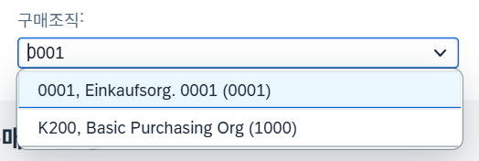

**Ekgrp(구매그룹) Value Help가 표시되지 않음.** Root View에서 이미 서치헬프를 설정해 두었음에도 뜨지 않아, Projection View에서도 `@ObjectModel.text.element: ['Eknam']` + `@UI.textArrangement: #TEXT_FIRST` + `@Consumption.valueHelpDefinition`을 다시 한번 선언해 해결함(표준 엘리먼트 설정이 Projection 레벨에서 다시 필요할 수 있음을 확인).

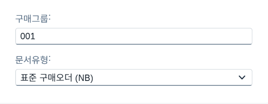
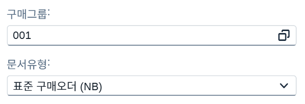
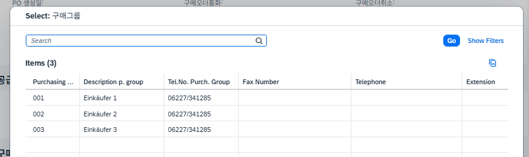

**Bsart(문서유형) Value Help가 아예 없음.** `_BsartText` Association만 잡혀 있고 `@Consumption.valueHelpDefinition`이 누락되어 있었음. 확인해 보니 서치헬프 자체가 없어 신규로 `ZI_B07_BSART_F4`(`I_DomainFixedValueText`, 도메인 `ZDB07BSART`)를 생성하고, `ZC_B07_EKKO`에 `@ObjectModel.text.element: ['BsartText']`/`@UI.textArrangement: #TEXT_FIRST`/`@Consumption.valueHelpDefinition`을 연결함. 겸사겸사 Bsart를 "구매 조직 정보"(OrgInfo) Facet에서 "구매오더 정보"(POInfo) Facet으로 옮기고, 같은 Facet 내 통화(Waers)/구매오더내역(Pdesc)/구매오더취소(Loekz) position을 30→60으로 재조정함.

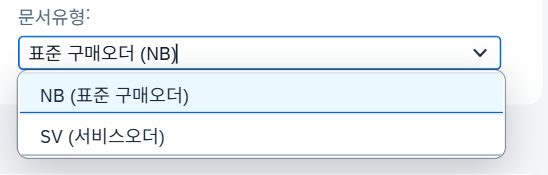

관련 오브젝트: [`ZI_B07_BSART_F4`](../../reference/00_common-searchhelp.md) · [코드 보기](../../src/00_common-searchhelp/cds/ZI_B07_BSART_F4.ddls.asddls)

지급조건(Zterm)/인코텀즈(Inco1)에 대한 Value Help가 없는 점은 확인했으나 이번에는 후순위로 미룸.

**아이템 생성 시 플랜트(K230) 입력 후 RAISE_SHORTDUMP 덤프 발생.** FS 요구사항("Item 생성시: 플랜트에 대한 필수 값 처리, 방식은 자유")은 화면 필수값이 아니라 Validation 체크로 처리하기로 이미 결정한 부분이라 무관함을 확인하고, 실제 원인 파악을 위해 ST22로 들어감.

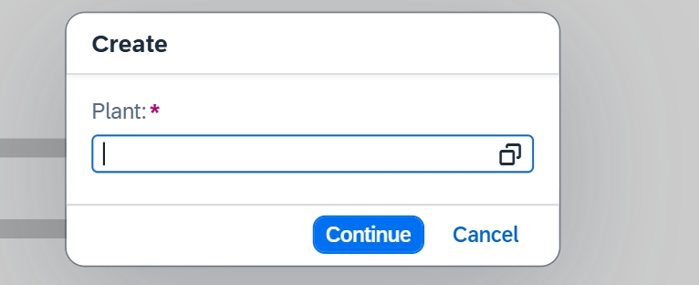
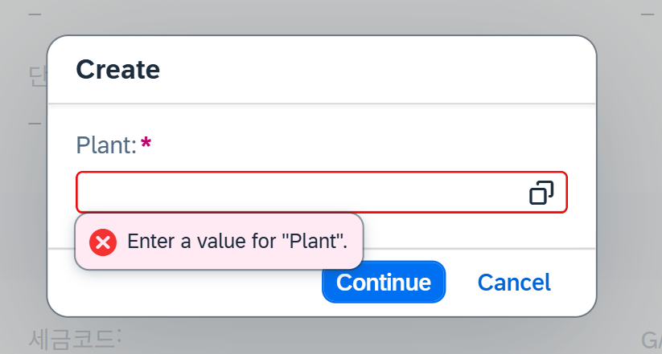
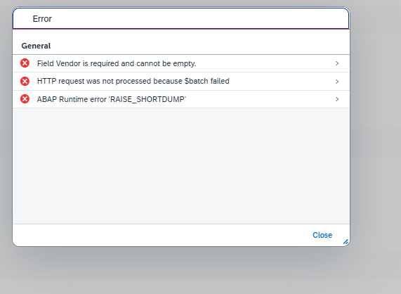
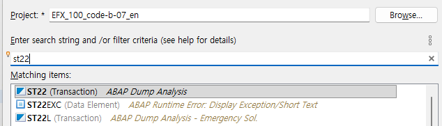

덤프는 `RAISE_SHORTDUMP`(`CX_CSP_ACT_RESPONSE`, `EN_NO_FAILED_NO_MAPPED`) — "early numbering 핸들러(`earlynumbering_create`)가 요청받은 인스턴스 중 하나에 대해 FAILED도 MAPPED도 돌려주지 않았다"는 오류. `mapped-ekpo`에 넣은 `%cid`가 프론트엔드가 부여한 `%cid`와 정확히 일치하지 않으면 커널이 "매칭 실패"로 판단해 이 덤프를 던짐. 우선 확인 차 Service Binding(`ZUI_B07_EKKO_V4`)에 들어가 보니 별도의 구문 오류(`A static read-only field 'WAERS' is not allowed for an editable amount field`)가 함께 발견됨.

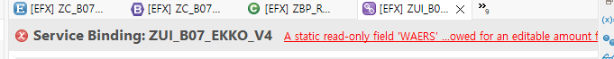

두 문제를 함께 정리하면 다음과 같음.

**1) WAERS 문제** — 덤프명 `CONVT_NO_NUMBER`(`CX_SY_CONVERSION_NO_NUMBER`). 원인: `Waers`를 정적 `readonly`로 막아 놓아, 내부 Determination(`SetHeaderDefaults`/`SetItemDefaults`)이나 early numbering 처리 과정에서 그 필드를 건드리며 충돌 → 채번 값 자리에 잘못된 값이 들어감. 헤더/아이템 모두 `Waers`를 정적 `readonly` 목록에서 제거하고 `field ( features : instance ) Waers;`로 전환함 — 아이템의 `get_instance_features`에는 "실제 DB에 이미 존재하는(=기존 저장분) 아이템이면 읽기전용, 신규 생성 중이면 편집 가능"이 되도록, 헤더의 `get_instance_features`에는 "구매오더번호(Ebeln)가 이미 채번되어 있으면(=최초 저장 이후) 읽기전용"이 되도록 `%field-Waers` COND 로직을 추가함.

**2) Early Numbering 문제** — 덤프명 `RAISE_SHORTDUMP`(`CX_CSP_ACT_RESPONSE`, `EN_NO_FAILED_NO_MAPPED`). 원인: 이 BO가 `with draft`라 인스턴스 매칭에 `%cid`뿐 아니라 `%is_draft`도 함께 확인하는데, 기존 `earlynumbering_create` 구현은 `mapped-ekpo`에 `%is_draft`를 채우지 않아 커널이 "요청과 다른 인스턴스"로 판단해 덤프를 던진 것으로 확인함. `earlynumbering_create`에서 `mapped-ekpo`에 `%cid`와 함께 `%is_draft = ls_item-%is_draft`를 채우도록 수정해 해결함.

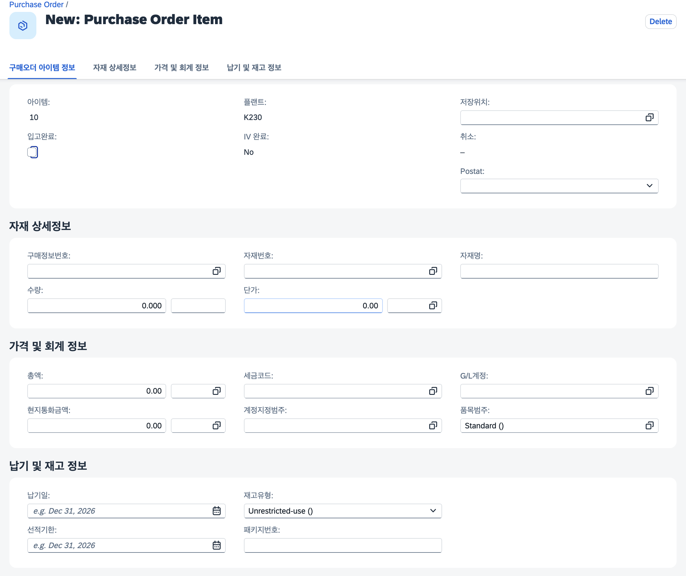

관련 오브젝트: [`ZR_B07_EKKO`](../../reference/06_purchase-order.md) · [코드 보기(BDEF)](../../src/06_purchase-order/bdef/ZR_B07_EKKO.bdef.asbdef) · [코드 보기(BIMP)](../../src/06_purchase-order/bimp/zbp_r_b07_ekko.clas.abap)

## 오늘 배운 점 / 막힌 점
- Projection View에서는 Association의 필드를 재구성(`_Xxx.Field as Alias`)해서 텍스트를 끌어올 수는 있지만, Association 정의 자체는 Interface/Root View에서 해야 한다.
- `field ( readonly ) X;`와 `field ( features : instance ) X;`는 같은 필드에 동시에 지정할 수 없다 — 동적 제어가 필요한 필드는 고정 readonly 목록에서 반드시 제외해야 한다.
- `create;`/`update;`/`delete;` 같은 표준 연산과 액션도 필드와 마찬가지로 `(features:instance)`를 명시해야 `%delete`/`%action-이름` 같은 동적 제어 컴포넌트가 생성된다.
- Early Numbering의 `FOR CREATE` 대상은 Root Entity에 Alias가 없으면 원래 Entity명 + Association명(`ZR_B07_EKKO\_Ekpo`)으로 지정해야 한다.
- 표준 F4가 명확하지 않은 필드(EPSTP)는 SE11/ME21N 화면의 F1 기술정보만으로는 부족할 수 있고, 필요하면 디버거로 표준 함수모듈(`HELP_VALUES_*`)까지 추적해 실제 소스 테이블을 확인해야 한다.
- Fiori Elements가 필드를 체크박스로 렌더링하려면 OData Edm 타입이 `Edm.Boolean`이어야 한다 — char1 도메인이라도 Interface View에서 `cast( ... as abap_boolean preserving type )`으로 명시적으로 변환해야 한다.
- 서치헬프 뷰 자체에서 `@ObjectModel.text.element`로 결합 텍스트를 이미 노출하고 있다면, 소비하는 필드 쪽에서 또 텍스트 어노테이션을 걸면 원래 필드 길이를 초과해 오류가 날 수 있다.
- Root View에서 이미 서치헬프를 연결해 두었더라도, Projection View에서 표준 엘리먼트가 다시 적용되며 무시될 수 있어 Projection에도 동일하게 재선언이 필요할 수 있다.
- `with draft` BO에서는 인스턴스 매칭에 `%cid`뿐 아니라 `%is_draft`도 함께 봐야 한다 — early numbering의 `mapped` 구조체에 `%is_draft`를 빠뜨리면 `RAISE_SHORTDUMP`(`EN_NO_FAILED_NO_MAPPED`)가 발생한다.
- 여러 필드가 동시에 `get_instance_features`의 대상이 될 수 있고, 이 경우 하나의 메서드 안에서 `%field-X` 항목을 함께 채워야 한다.

## 남은 이슈 / 확인 필요
- 지급조건(Zterm)/인코텀즈(Inco1) Value Help 미구현(후순위로 보류).
- 구매오더내역(Pdesc) 서치헬프 미적용(후순위로 보류, 구매정보레코드용 서치헬프 재사용 검토 예정).

## 내일 할 일
- 포트폴리오 정리를 진행하며 부족한 부분 보완.
- 최종 테스트 및 간단한 오류 수정.
- 104번 화면(Classic ABAP, 3종 비교) 착수.
