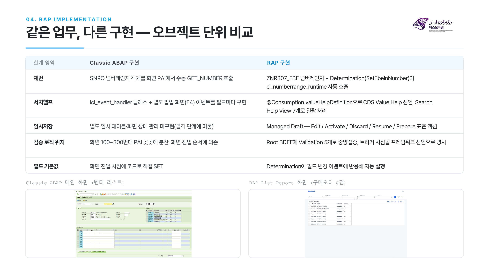
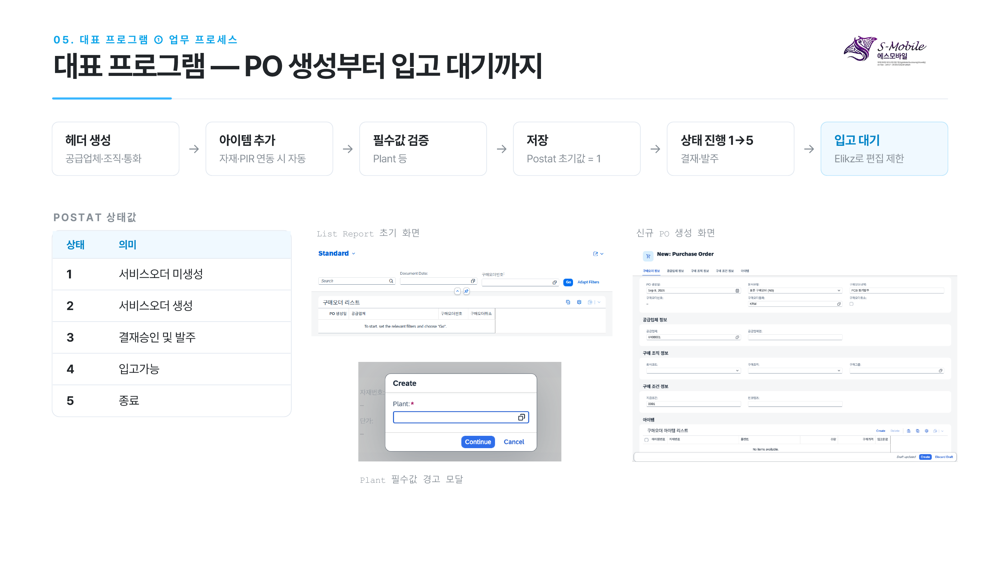
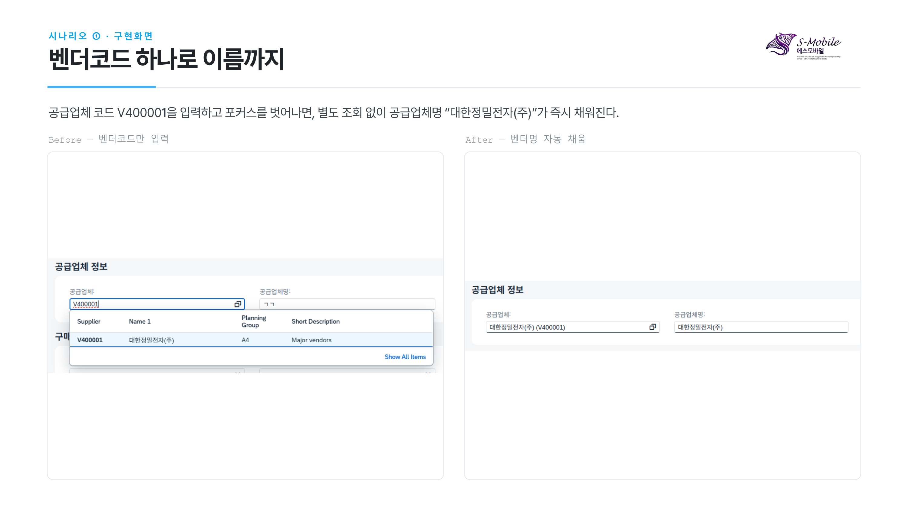
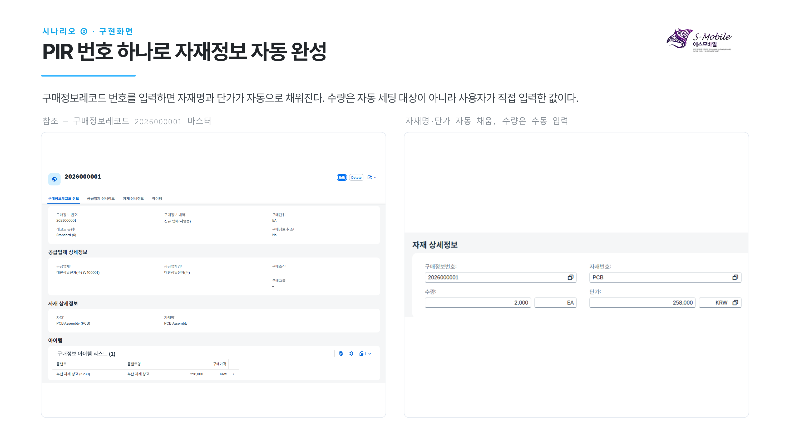
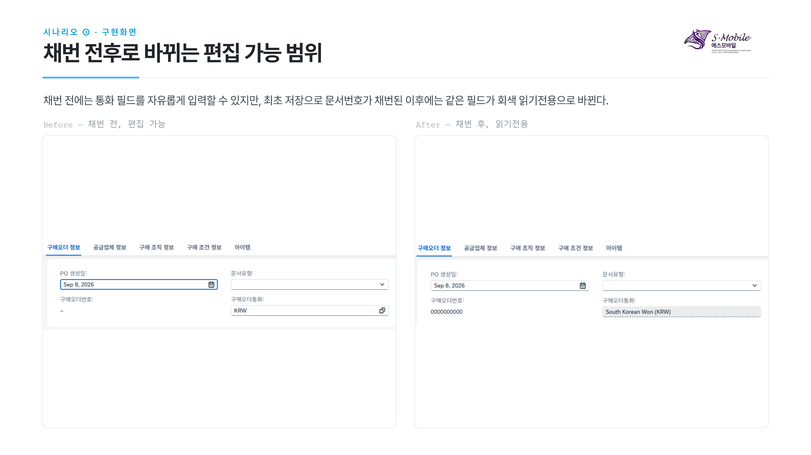
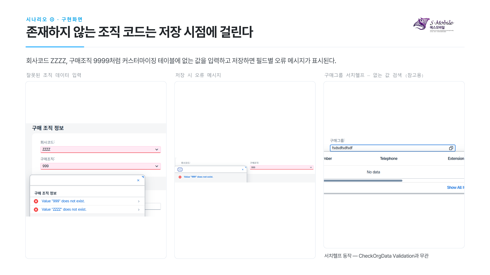
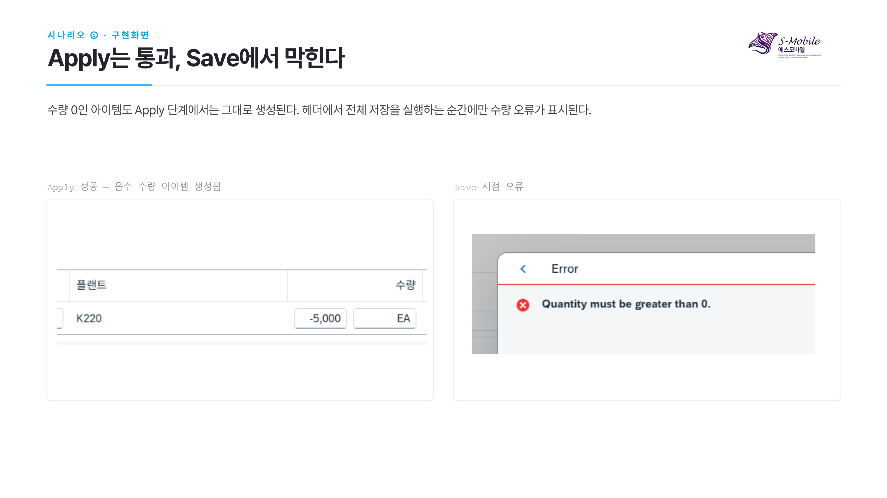
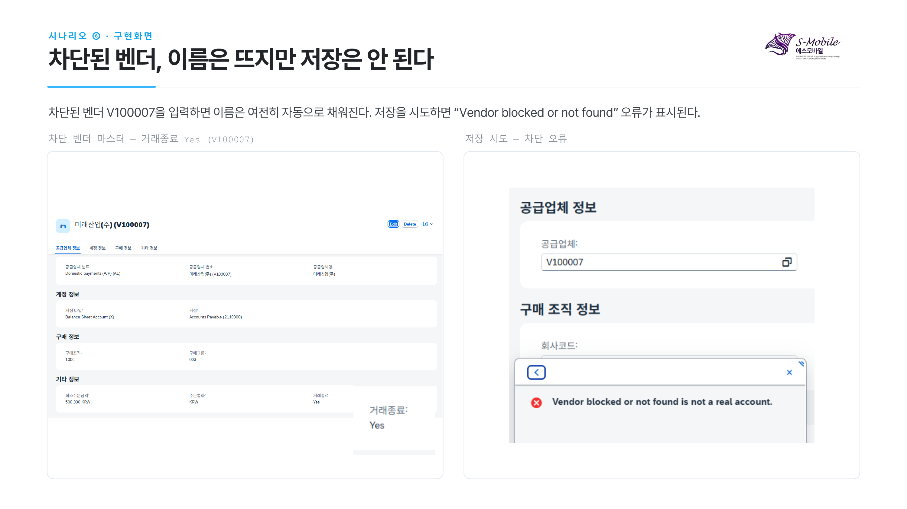
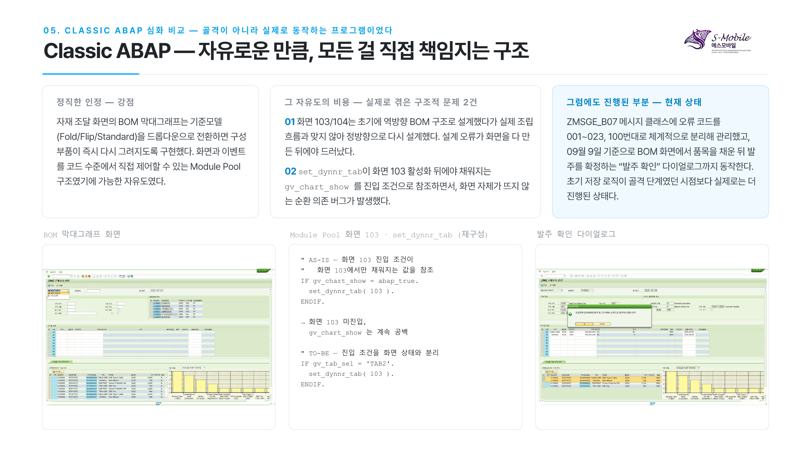

# 개인 포트폴리오 — SAP Clean Core 기반 S-Mobile MM-SD-FI 통합 RAP 애플리케이션 구축

> KDT 심화 2기 제출 포트폴리오(PDF) 내용을 그대로 옮기되, 읽기 좋은 글로 재구성한 버전입니다. 원본은 [individual-portfolio.pdf](./individual-portfolio.pdf)에서 확인할 수 있습니다.

**작성자**: 박가을(B07) — 담당 모듈 [00]공통 ~ [06]구매오더
**개발기간**: 2026.08.12 ~ 09.09 (KDT 심화 2기 전체 일정 2026.07.20 ~ 09.14)
**대표 프로그램**: 06. 구매오더관리 — Classic ABAP 병행 개발로 AS-IS/TO-BE 직접 비교

---

## 1. 회사 개요 및 조직 구조

S-Mobile은 신제품 스마트폰 3종(Fold, Flip, Standard) 출시를 앞둔 가상 기업이다. 반제품·부품·포장재를 모두 외부에서 조달해 조립·포장까지 수행하는 유통·조립 기업으로, 별도의 원자재 가공 공정은 갖고 있지 않다. 자재 등록부터 구매·입고·판매·출고·회계 처리까지의 업무가 부서별 시스템으로 나뉘어 데이터 불일치와 비효율이 발생해왔고, 이를 하나의 SAP RAP 기반 통합 시스템으로 구축하는 것이 이번 프로젝트의 출발점이다.

| 구분 | 값 | 설명 |
|---|---|---|
| 회사코드 | K200 | 가상 기업 S-Mobile Company |
| 플랜트 | K220 | 본체 조달 및 포장 |
| 플랜트 | K230 | 부품·전자 자재 조달 |
| 구매조직 | 1000 | Basic Purchasing Org |
| 구매그룹 | 001 | 전자부품(PCB·본체) 담당 |
| 구매그룹 | 002 | 케이블·소모품 담당 |
| 구매그룹 | 003 | 포장재 담당 |

자재 흐름은 K230(부품 조달)과 K220(본체 조달)이 BOM 조립(Fold/Flip/Standard)으로 합쳐진 뒤 K220에서 포장을 거쳐 완제품이 되는 구조다.

## 2. AS-IS → TO-BE — Classic ABAP에서 RAP으로, 왜 전환이 필요한가

1. **채번을 프레임워크가 대신해주지 않는다.** UUID나 문서번호를 자동 발급하는 표준 기능이 없어 저장 로직을 처음부터 끝까지 직접 설계해야 한다. 이번 구매오더 Classic 클론에서도 저장·삭제 로직은 아직 골격 수준에 머물러 있다.
2. **값도움말을 화면마다 손으로 만들어야 한다.** 필드 하나에 값도움말을 붙이려면 이벤트 핸들러와 팝업 화면을 별도로 구현해야 한다. 벤더 목록 하나를 값도움말로 쓰기 위해 별도의 ALV 화면과 이벤트 처리 클래스를 새로 만들어야 했다.
3. **임시저장 개념이 없다.** 작업 중인 데이터를 안전하게 보관하려면 별도의 임시 테이블과 화면 상태 관리를 처음부터 설계해야 한다.
4. **화면 흐름의 순서를 전부 손으로 설계해야 해서 구조적으로 취약하다.** 아직 뜨지 않은 화면의 값을 참조하는 순환 의존 버그가 발생하기 쉽다. 실제로 화면 간 참조 순서 문제로 화면이 뜨지 않는 오류를 겪었다.

RAP은 이 네 가지를 Managed 채번, CDS Value Help, Draft, Determination·Validation으로 대체한다.

## 3. RAP 설계 — 데이터 모델과 View 계층

담당 범위 7개 모듈(00~06)은 공통 자재(마스터)를 중심으로 구매정보레코드와 구매오더까지 하나의 참조 체계로 연결된다. 회계 계정과 계정결정 규칙은 별도 축으로 존재하며, 벤더 마스터의 결제 계정을 통해 FI 축과 연결된다.

| 모듈 | 테이블 | 주요 필드 | 역할 |
|---|---|---|---|
| 00 | 공통 Search Help | - | 12개 F4 CDS, 자재유형 등 |
| 01 | [`ZTB07MARA`](../src/01_material-mgmt/tables/ZTB07MARA.tabl.asddls) | mat_uuid(PK), Mtart, Bklas | 자재 마스터 |
| 02 | [`ZTB07SKA1`](../src/02_fi-account/tables/ZTB07SKA1.tabl.asddls) | saknr(PK), Glact | FI 계정 마스터 |
| 03 | [`ZTB07LFA1`](../src/03_vendor/tables/ZTB07LFA1.tabl.asddls) | lif_uuid(PK), Akont | 공급업체 마스터 |
| 04 | [`ZTB07T030`](../src/04_account-determination/tables/ZTB07T030.tabl.asddls) | Bwart+Ktosl(PK), Saknr | 회계계정결정 |
| 05 | [`ZTB07EINA`/`EINE`](../src/05_purchase-info/tables/) | inf_uuid(PK) | 구매정보레코드 |
| 06 | [`ZTB07EKKO`/`EKPO`](../src/06_purchase-order/tables/) | ebeln_uuid(PK) | 구매오더 헤더/아이템 |

관계는 `ZTB07LFA1.Akont → ZTB07SKA1.Saknr`(공급업체→매입채무 계정), `ZTB07T030.Saknr → ZTB07SKA1.Saknr`(계정결정→FI계정), `ZTB07EINA.lif_uuid/mat_uuid`(구매정보레코드→공급업체/자재), `ZTB07EKKO.lif_uuid`(구매오더 헤더→공급업체), `ZTB07EKPO.ebeln_uuid/mat_uuid/inf_uuid`(구매오더 아이템→헤더/자재/구매정보레코드) 순으로 이어진다.

구매오더 데이터 모델은 Interface View에서 원본 필드와 연관관계를 정의하고, Root View에서 비즈니스 키와 트랜잭션 동작을 결정하며, Projection View에서 Fiori 화면에 노출할 필드와 Facet 구성을 확정하는 3단계로 설계했다.

```
ZI_B07_EKKO / ZI_B07_EKPO  (Interface View — 원본 필드 + 연관관계)
        │  텍스트 연관(_BukrsText 등)은 Root에서만 소비 가능
        ▼
ZR_B07_EKKO  (Root View — Managed, With Draft)
  BDEF: 비즈니스 키 EbelnUuid / Draft 활성화
  Determination 5개 · Validation 5개 · Instance Feature 3개
        │
        ▼
ZC_B07_EKKO / ZC_B07_EKPO  (Projection View)
  MDE Facets: POInfo / VendorInfo / OrgInfo / CondInfo / ItemInfo / MatDetail / PriceAcct / DeliveryStock
  Search Help 연결: ZI_B07_EBELN_F4, ZI_B07_BSART_F4 등 7개 View
```

| Search Help View | 대상 필드 |
|---|---|
| [`ZI_B07_EBELN_F4`](../src/00_common-searchhelp/cds/ZI_B07_EBELN_F4.ddls.asddls) | Ebeln(구매오더번호) |
| [`ZI_B07_BSART_F4`](../src/00_common-searchhelp/cds/ZI_B07_BSART_F4.ddls.asddls) | Bsart(문서유형) |
| [`ZI_B07_INFNR_F4`](../src/00_common-searchhelp/cds/) | Infnr(구매정보레코드) |
| [`ZI_B07_INSMK_F4`](../src/00_common-searchhelp/cds/) | Insmk(재고유형) |
| [`ZI_B07_EPSTP_F4`](../src/00_common-searchhelp/cds/) | Epstp(품목범주) — 소스 테이블 `T163Y`로 확정(도메인 고정값이 아니라 디버깅으로 직접 확인) |
| [`ZI_B07_MWSKZ_F4`](../src/00_common-searchhelp/cds/) | Mwskz(세금코드) |
| [`ZI_B07_POSTAT_F4`](../src/00_common-searchhelp/cds/) | Postat(구매오더상태) |

## 4. RAP 구현 — Classic ABAP vs RAP, 오브젝트 단위 비교

| 한계 영역 | Classic ABAP 구현 | RAP 구현 |
|---|---|---|
| 채번 | SNRO 넘버레인지 객체를 화면 PAI에서 수동 GET_NUMBER 호출 | `ZNRB07_EBE` 넘버레인지 + Determination(`SetEbelnNumber`)이 `cl_numberrange_runtime` 자동 호출 |
| 서치헬프 | `lcl_event_handler` 클래스 + 별도 팝업 화면(F4) 이벤트를 필드마다 구현 | `@Consumption.valueHelpDefinition`으로 CDS Value Help 선언, Search Help View 7개로 일괄 처리 |
| 임시저장 | 별도 임시 테이블·화면 상태 관리 미구현(골격 단계에 머묾) | Managed Draft — Edit / Activate / Discard / Resume / Prepare 표준 액션 |
| 검증 로직 위치 | 화면 100~300번대 PAI 곳곳에 분산, 화면 진입 순서에 의존 | Root BDEF에 Validation 5개로 중앙집중, 트리거 시점을 프레임워크 선언으로 명시 |
| 필드 기본값 설정 | 화면 진입 시점에 코드로 직접 SET | Determination이 필드 변경 이벤트에 반응해 자동 실행 |

채번·잠금·임시저장처럼 Classic에서 매번 새로 설계해야 했던 인프라를 RAP은 프레임워크 표준 기능으로 제공해, 개발자는 비즈니스 로직 자체에 집중할 수 있다. 검증과 기본값 설정이 화면 코드가 아니라 Root BDEF 한 곳에 선언적으로 모이면서, 로직의 실행 시점과 순서가 코드 작성 위치가 아니라 프레임워크 규칙으로 결정되어 순환 의존 같은 구조적 버그 가능성이 줄어든다.



## 5. 대표 프로그램 ① — PO 생성부터 입고 대기까지

구매오더 관리는 헤더 정보 입력으로 시작해 아이템을 추가하고, 상태값이 결재·발주 단계를 거쳐 입고 가능 상태에 도달하는 흐름으로 설계했다. 각 단계는 FS 4.1 CRUD 정의를 기준으로 구현했다.

```
[헤더 생성] → [아이템 추가] → [필수값 검증] → [저장] → [상태 진행 1→5] → [입고 대기]
 공급업체·      자재·PIR         Plant 등        Postat        결재·발주       Elikz로
 조직·통화      연동 시 자동                     초기값=1                    이후 편집 제한
```

| Postat(구매오더 상태) | 의미 |
|---|---|
| 1 | 서비스오더 미생성 |
| 2 | 서비스오더 생성 |
| 3 | 결재승인 및 발주 |
| 4 | 입고가능 |
| 5 | 종료 |



## 6. 대표 프로그램 ② — FS를 TS로, 직접 내린 설계 판단

FS는 기능 요구사항만 정의하고 구현 방식은 열어둔 항목이 많았다. 아래는 그 항목을 RAP 오브젝트로 옮기며 직접 결정한 설계 판단이다.

| FS 요구사항 | TS 설계 판단 |
|---|---|
| PO 생성일 = 현재일, 통화 = KRW | Determination(SetHeaderDefaults)에서 헤더 생성 시점에 자동 세팅, 이후 사용자가 수정 가능한 단순 기본값으로 설계 |
| Ebeln은 자동 채번 | Managed 채번 방식 채택, 넘버레인지 객체 ZNRB07_EBE 지정 후 Determination(SetEbelnNumber)에서 cl_numberrange_runtime 호출 |
| Item 필수값: Plant, "입력 방식은 자유" | Plant는 자재마다 다를 수 있어 Header가 아닌 Item 단위 필수값으로 설계, 미입력 시 저장 시점에 경고 모달 |
| Item 순번 10/20/30 자동 | Early Numbering으로 Ebelp를 10 단위 증가 처리, Draft 상태에서 순번이 어긋나는 문제를 %is_draft 매핑 추가로 해결 |
| Item 통화 = Header 값 | Determination이 Item 생성 시 Header의 Waers를 그대로 상속하도록 설계 |
| 입고완료·IV완료·구매오더취소 시 필드 disabled | Instance Feature(Elikz 등)로 후속 프로세스 진행 여부에 따라 편집 가능 범위를 동적으로 제한 |

## 7. 설계 총괄 — Root 하나에 담긴 15개 로직

구매오더 Root BDEF에는 필드 기본값을 채우는 Determination, 저장 시점에 데이터를 검증하는 Validation, 화면 편집 가능 범위를 제어하는 Instance Feature가 함께 정의되어 있다. 세 종류는 트리거 시점이 서로 달라 같은 "로직"이라도 실행되는 순간이 다르다.

| Determination · 6 | 트리거 시점 |
|---|---|
| SetHeaderDefaults | 헤더 생성 시 |
| SetVendorUuid | 벤더코드 포커스아웃 |
| SetEbelnNumber | 헤더 저장 시(채번) |
| SetItemDefaults | 아이템 생성 시 |
| SetInfoRecordDefault | 자재 입력 시(PIR 존재) |
| SetMaterialUuid | 자재코드 입력 시 |

| Validation · 5 | 트리거 시점 |
|---|---|
| CheckRequired | 저장 시(필수값) |
| CheckVendorValid | 저장 시(벤더 유효성) |
| CheckOrgData | 저장 시(조직 데이터) |
| CheckPositiveQty | 저장 시(수량 양수) |
| CheckDuplicateItem | 저장 시(아이템 중복) |

| Instance Feature · 3 | 트리거 시점 | | Early Numbering · 1 | 트리거 시점 |
|---|---|---|---|---|
| Loekz | Draft 편집 중 상시 | | Ebelp 자동채번 | 아이템 생성 시(10 단위) |
| Elikz | 후속 프로세스 진행 후 | | | |
| Waers | 저장 전후 | | | |

이어지는 절에서는 실제 화면 증빙이 확보된 6개 시나리오를 순서대로 심화한다. 모든 로직은 [`zbp_r_b07_ekko.clas.abap`](../src/06_purchase-order/bimp/zbp_r_b07_ekko.clas.abap)(BDEF는 [`ZR_B07_EKKO.bdef.asbdef`](../src/06_purchase-order/bdef/ZR_B07_EKKO.bdef.asbdef))에 구현되어 있다.

### 시나리오 ① · Determination — 벤더코드 입력만으로 이름을 채운다

벤더코드(Lifnr)를 입력하면 벤더명이 즉시 채워지도록 설계했다. 저장 시점이 아니라 필드 변경 즉시 실행하는 이유는, 사용자가 입력을 마치기 전에 자신이 입력한 코드가 실제 존재하는 벤더인지 눈으로 바로 확인할 수 있게 하기 위함이다. 조회 조건은 LifUuid가 비어 있고 Lifnr이 입력된 경우로 한정해, 이미 UUID가 연결된 레코드를 매 변경마다 다시 조회하지 않도록 했다.

이 로직은 벤더 차단 여부(Loevm)를 조회하지 않는다. SELECT 절에 lif_uuid, lifnr, name1만 있고 loevm은 아예 없다. 이름 자동완성이라는 편의 기능과 차단 벤더 검증이라는 업무 규칙을 의도적으로 분리한 설계이며, 차단 검증은 저장 시점의 CheckVendorValid(시나리오 ⑥)가 담당한다.

```abap
METHODS SetVendorUuid FOR DETERMINE ON MODIFY
  IMPORTING keys FOR zr_b07_ekko~SetVendorUuid.

METHOD SetVendorUuid.
  DATA: lt_update TYPE TABLE FOR UPDATE zr_b07_ekko.

  READ ENTITIES OF zr_b07_ekko IN LOCAL MODE
    ENTITY zr_b07_ekko
      FIELDS ( LifUuid Lifnr )
      WITH CORRESPONDING #( keys )
    RESULT DATA(lt_ekko).

  SELECT lif_uuid, lifnr, name1 FROM ztb07lfa1
    INTO TABLE @DATA(lt_db_lfa1).

  LOOP AT lt_ekko INTO DATA(ls_ekko)
        WHERE LifUuid IS INITIAL AND Lifnr IS NOT INITIAL.
    READ TABLE lt_db_lfa1 INTO DATA(ls_db_lfa1) WITH KEY lifnr = ls_ekko-Lifnr.
    IF sy-subrc = 0.
      APPEND VALUE #( %tky    = ls_ekko-%tky
                       LifUuid = ls_db_lfa1-lif_uuid
                       Name1   = ls_db_lfa1-name1 ) TO lt_update.
    ENDIF.
  ENDLOOP.

  IF lt_update IS NOT INITIAL.
    MODIFY ENTITIES OF zr_b07_ekko IN LOCAL MODE
      ENTITY zr_b07_ekko
        UPDATE FIELDS ( LifUuid Name1 )
        WITH lt_update.
  ENDIF.
ENDMETHOD.
```



### 시나리오 ② · Determination — 구매정보레코드 번호 하나로 자재정보를 끌어온다

`DELETE lt_ekpo WHERE Infnr IS INITIAL`로 PIR을 참조하지 않는 아이템은 대상에서 제외해, 마스터에 없는 스팟성 구매 품목은 자동 로직을 타지 않고 수동 입력을 허용한다. 단가는 EINE(플랜트별 구매조건)을 Werks 기준으로 조회하고, 해당 플랜트 조건이 없으면 기존 입력값을 유지하는 폴백을 뒀다. 자동으로 채우는 필드는 MatUuid·Matnr·Meins·Netpr뿐이며, 수량은 사용자가 직접 입력한다.

```abap
METHODS SetInfoRecordDefault FOR DETERMINE ON MODIFY
  IMPORTING keys FOR ekpo~SetInfoRecordDefault.

METHOD SetInfoRecordDefault.
  DATA: lt_update TYPE TABLE FOR UPDATE zi_b07_ekpo.

  READ ENTITIES OF zr_b07_ekko IN LOCAL MODE
    ENTITY Ekpo
      FIELDS ( Infnr Werks Netpr )
      WITH CORRESPONDING #( keys )
    RESULT DATA(lt_ekpo).

  DELETE lt_ekpo WHERE Infnr IS INITIAL.
  CHECK lt_ekpo IS NOT INITIAL.

  SELECT inf_uuid, infnr, mat_uuid FROM ztb07eina
    FOR ALL ENTRIES IN @lt_ekpo
    WHERE infnr = @lt_ekpo-Infnr
    INTO TABLE @DATA(lt_db_eina).

  SELECT inf_uuid, werks, netpr FROM ztb07eine
    FOR ALL ENTRIES IN @lt_db_eina
    WHERE inf_uuid = @lt_db_eina-inf_uuid
    INTO TABLE @DATA(lt_db_eine).

  SELECT mat_uuid, matnr, meins FROM ztb07mara
    FOR ALL ENTRIES IN @lt_db_eina
    WHERE mat_uuid = @lt_db_eina-mat_uuid
    INTO TABLE @DATA(lt_db_mara).

  LOOP AT lt_ekpo INTO DATA(ls_ekpo).
    READ TABLE lt_db_eina INTO DATA(ls_eina)
        WITH KEY infnr = ls_ekpo-Infnr.
    CHECK sy-subrc = 0.

    READ TABLE lt_db_mara INTO DATA(ls_mara)
        WITH KEY mat_uuid = ls_eina-mat_uuid.
    READ TABLE lt_db_eine INTO DATA(ls_eine)
        WITH KEY inf_uuid = ls_eina-inf_uuid
                 werks    = ls_ekpo-Werks.

    APPEND VALUE #( %tky    = ls_ekpo-%tky
                     MatUuid = ls_eina-mat_uuid
                     Matnr   = ls_mara-matnr
                     Meins   = ls_mara-meins
                     Netpr   = COND #( WHEN sy-subrc = 0
                                        THEN ls_eine-netpr
                                        ELSE ls_ekpo-Netpr ) )
      TO lt_update.
  ENDLOOP.

  IF lt_update IS NOT INITIAL.
    MODIFY ENTITIES OF zr_b07_ekko IN LOCAL MODE
      ENTITY Ekpo
        UPDATE FIELDS ( MatUuid Matnr Meins Netpr )
        WITH lt_update.
  ENDIF.
ENDMETHOD.
```



### 시나리오 ③ · Instance Feature — 저장 전엔 입력 가능, 저장 후엔 읽기전용

Determination이 값을 채우고 Validation이 값을 검증한다면, Instance Feature는 필드를 "편집할 수 있는가"를 동적으로 제어한다. 통화(Waers)는 채번 이후 회계·구매 정합성이 걸리므로 잠근다. 판단 기준은 저장 여부가 아니라 **Ebeln 채번 여부**다. 구매오더취소 필드(Loekz)는 정반대 조건으로, 미채번 문서는 읽기전용, 채번 후에만 편집 가능하다. 아이템 레벨의 Waers도 같은 사고방식이 반복된다 — DB에 이미 저장된 아이템이면 읽기전용, 신규면 편집 가능. Postat은 그 반대다.

```abap
" Instance Feature Waers·Loekz · lhc_ZR_B07_EKKO (Header)
METHOD get_instance_features.
  READ ENTITIES OF zr_b07_ekko IN LOCAL MODE
    ENTITY zr_b07_ekko
      FIELDS ( Ebeln )
      WITH CORRESPONDING #( keys )
    RESULT DATA(lt_ekko).

  result = VALUE #( FOR ls_ekko IN lt_ekko
    ( %tky    = ls_ekko-%tky
      %delete = COND #( WHEN ls_ekko-Ebeln IS NOT INITIAL
                         THEN if_abap_behv=>fc-o-disabled
                         ELSE if_abap_behv=>fc-o-enabled )
      %action-SetDeletionFlag
              = COND #( WHEN ls_ekko-Ebeln IS NOT INITIAL
                         THEN if_abap_behv=>fc-o-enabled
                         ELSE if_abap_behv=>fc-o-disabled )
      " 통화(Waers)는 PO 채번(=최초 저장) 전까지만 편집 가능
      %field-Waers
              = COND #( WHEN ls_ekko-Ebeln IS NOT INITIAL
                         THEN if_abap_behv=>fc-f-read_only
                         ELSE if_abap_behv=>fc-f-unrestricted )
      " Loekz: 미채번 시 readonly, 채번 후에만 편집 가능
      %field-Loekz
              = COND #( WHEN ls_ekko-Ebeln IS NOT INITIAL
                         THEN if_abap_behv=>fc-f-unrestricted
                         ELSE if_abap_behv=>fc-f-read_only ) ) ).
ENDMETHOD.
```



### 시나리오 ④ · Validation — 조직 데이터는 SAP 표준 커스터마이징 테이블로 검증한다

회사코드(Bukrs)·구매조직(Ekorg)·구매그룹(Ekgrp)을 각각 T001·T024E·T024에 존재하는 값인지 저장 시점에 검증한다. 입력 도중이 아니라 저장 시점인 이유는, 조직 데이터는 중간에 매번 막을 필요 없이 최종 커밋 시점의 정합성만 보장하면 되기 때문이다. 존재 여부만 필요하므로 `TRANSPORTING NO FIELDS`로 불필요한 필드 조회 없이 확인한다. 이 Validation은 존재 여부만 확인하고 오류를 반환할 뿐 값을 바꾸지 않는다.

```abap
METHODS CheckOrgData FOR VALIDATE ON SAVE
  IMPORTING keys FOR zr_b07_ekko~CheckOrgData.

METHOD CheckOrgData.
  READ ENTITIES OF zr_b07_ekko IN LOCAL MODE
    ENTITY zr_b07_ekko
      FIELDS ( Bukrs Ekorg Ekgrp )
      WITH CORRESPONDING #( keys )
    RESULT DATA(lt_ekko).

  SELECT bukrs FROM t001  INTO TABLE @DATA(lt_t001).
  SELECT ekorg FROM t024e INTO TABLE @DATA(lt_t024e).
  SELECT ekgrp FROM t024  INTO TABLE @DATA(lt_t024).

  LOOP AT lt_ekko INTO DATA(ls_ekko).
    IF ls_ekko-Bukrs IS NOT INITIAL.
      READ TABLE lt_t001 TRANSPORTING NO FIELDS
          WITH KEY bukrs = ls_ekko-Bukrs.
      IF sy-subrc <> 0.
        APPEND VALUE #( %tky = ls_ekko-%tky )
          TO failed-zr_b07_ekko.
        APPEND VALUE #(
          %tky = ls_ekko-%tky
          %element-Bukrs = if_abap_behv=>mk-on
          %msg = new_message(
            id = 'ZMSGE_B07' number = '020'
            v1 = 'Company Code' v2 = ls_ekko-Bukrs
            severity = if_abap_behv_message=>severity-error ) )
          TO reported-zr_b07_ekko.
      ENDIF.
    ENDIF.
    " Ekorg → t024e, Ekgrp → t024 동일 패턴 반복
  ENDLOOP.
ENDMETHOD.
```



### 시나리오 ⑤ · Validation — Apply 시점이 아니라 저장 시점에 걸린다

수량이 0 이하인지 검증하는 로직을 Item Apply가 아니라 SAVE 시점에 걸리도록 설계했다. RAP Draft 흐름에서 Apply는 아이템 팝업의 값을 Draft에 임시 반영하는 단계이고, Validation ON SAVE는 문서 전체를 최종 커밋하는 시점에만 실행된다. 그래서 수량을 0으로 둔 채 아이템을 만들어도 Apply는 그대로 성공하고, 헤더에서 전체 저장을 실행하는 순간에야 오류가 반환된다. 입력 중간마다 막지 않고 최종 커밋 시점에만 정합성을 강제하는 설계다.

```abap
METHODS CheckPositiveQty FOR VALIDATE ON SAVE
  IMPORTING keys FOR Ekpo~CheckPositiveQty.

METHOD CheckPositiveQty.
  READ ENTITIES OF zr_b07_ekko IN LOCAL MODE
    ENTITY Ekpo
      FIELDS ( Menge )
      WITH CORRESPONDING #( keys )
    RESULT DATA(lt_ekpo).

  LOOP AT lt_ekpo INTO DATA(ls_ekpo) WHERE Menge <= 0.
    APPEND VALUE #( %tky = ls_ekpo-%tky ) TO failed-ekpo.
    APPEND VALUE #(
      %tky = ls_ekpo-%tky
      %element-Menge = if_abap_behv=>mk-on
      %msg = new_message(
        id = 'ZMSGE_B07' number = '023'
        v1 = 'Quantity'
        severity = if_abap_behv_message=>severity-error ) )
      TO reported-ekpo.
  ENDLOOP.
ENDMETHOD.
```



### 시나리오 ⑥ · Validation — 이름은 보여주되, 저장은 막는다

시나리오 ①의 SetVendorUuid는 차단 여부(Loevm)를 확인하지 않고 이름만 채운다. 이 Validation은 그 반대편 역할을 맡는다. 저장 시점에 LifUuid가 해석되지 않았거나 Loevm이 차단 상태인 벤더면 저장을 막는다. 두 로직을 나눈 이유는, 입력 중에는 어떤 벤더 코드를 넣었는지 이름으로 바로 확인할 수 있게 하되, 거래 가능 여부라는 업무 규칙은 최종 저장 시점에만 엄격하게 적용하기 위함이다.

```abap
METHODS CheckVendorValid FOR VALIDATE ON SAVE
  IMPORTING keys FOR zr_b07_ekko~CheckVendorValid.

METHOD CheckVendorValid.
  READ ENTITIES OF zr_b07_ekko IN LOCAL MODE
    ENTITY zr_b07_ekko
      FIELDS ( LifUuid )
      WITH CORRESPONDING #( keys )
    RESULT DATA(lt_ekko).

  SELECT lif_uuid, loevm FROM ztb07lfa1
    INTO TABLE @DATA(lt_db_lfa1).

  LOOP AT lt_ekko INTO DATA(ls_ekko)
        WHERE LifUuid IS NOT INITIAL.
    READ TABLE lt_db_lfa1 INTO DATA(ls_db_lfa1)
        WITH KEY lif_uuid = ls_ekko-LifUuid.

    IF sy-subrc <> 0 OR ls_db_lfa1-loevm = abap_true.
      APPEND VALUE #( %tky = ls_ekko-%tky )
        TO failed-zr_b07_ekko.
      APPEND VALUE #(
        %tky = ls_ekko-%tky
        %element-LifUuid = if_abap_behv=>mk-on
        %msg = new_message(
          id = 'ZMSGE_B07' number = '020'
          v1 = 'Vendor' v2 = 'blocked or not found'
          severity = if_abap_behv_message=>severity-error ) )
        TO reported-zr_b07_ekko.
    ENDIF.
  ENDLOOP.
ENDMETHOD.
```



## 8. 대표 프로그램: Classic ABAP 심화 비교 — 자유로운 만큼, 모든 걸 직접 책임지는 구조

**정직한 인정 — 강점.** 자재 조달 화면의 BOM 막대그래프는 기준모델(Fold/Flip/Standard)을 드롭다운으로 전환하면 구성 부품이 즉시 다시 그려지도록 구현했다. 화면과 이벤트를 코드 수준에서 직접 제어할 수 있는 Module Pool 구조였기에 가능한 자유도였다.

**그 자유도의 비용 — 실제로 겪은 구조적 문제 2건.**
1. 화면 103/104는 초기에 역방향 BOM 구조로 설계했다가, 실제 조립 흐름과 맞지 않아 정방향으로 다시 설계했다. 화면 흐름을 코드로 직접 짜다 보니 설계 오류가 화면을 다 만든 뒤에야 드러났다.
2. `set_dynnr_tab`이 화면 103이 이미 활성화된 뒤에야 채워지는 `gv_chart_show`를 화면 진입 조건으로 참조하면서, 화면 자체가 뜨지 않는 순환 의존 버그가 발생했다. 화면 간 참조 순서를 프레임워크가 관리해주지 않기 때문에 생긴 문제였다.

**그럼에도 진행된 부분 — 정확한 현재 상태.** `ZMSGE_B07` 메시지 클래스에 오류 코드를 001~023, 100번대로 체계적으로 분리해 관리했고, 09월 9일 기준으로는 BOM 화면에서 품목을 채운 뒤 발주를 확정하는 "발주 확인" 다이얼로그까지 동작한다. 초기 저장 로직이 골격 단계였던 시점보다 실제로는 더 진행된 상태다.

관련 오브젝트: [`ZB07EKKO_TOP`](../src/06_purchase-order/prog/ZB07EKKO_TOP.prog.abap) · [`ZB07EKKO_O01`](../src/06_purchase-order/prog/ZB07EKKO_O01.prog.abap) · [`ZB07EKKO_F01`](../src/06_purchase-order/prog/ZB07EKKO_F01.prog.abap) · [`ZB07EKKO_I01`](../src/06_purchase-order/prog/ZB07EKKO_I01.prog.abap) · [`ZB07EKKO_C01`](../src/06_purchase-order/prog/ZB07EKKO_C01.prog.abap)



## 9. 개선 결과

직접 설계해야 할 화면은 9개(100/101/102/103/104/130/200/300/9000)에서 List Report + Object Page 2개로 줄고, 화면 PAI 곳곳에 흩어져 있던 로직 15개(Determination 6 · Validation 5 · Instance Feature 3 · Early Numbering 1)가 Root BDEF 한 곳으로 모였다. 임시저장·잠금도 미구현에서 Managed Draft 표준 액션 5종(Edit/Activate/Discard/Resume/Prepare)으로 바뀌었고, 서치헬프도 필드별 개별 구현에서 공용 Search Help View 7개로 정리됐다.

RAP 개발 중에도 버그는 있었다. Early Numbering에서 `%is_draft` 매핑을 빠뜨려 `EN_NO_FAILED_NO_MAPPED` 덤프가 난 적이 있다. 차이는 원인 파악 방식이다. Classic의 버그는 화면이 그냥 뜨지 않아 화면 흐름을 손으로 추적해야 했고, RAP의 버그는 ADT가 덤프 원인과 수정 지점을 바로 알려줬다.

| 항목 | Classic ABAP | RAP |
|---|---|---|
| 서치헬프 구현 방식 | 커스텀 이벤트 핸들러 클래스, 필드마다 개별 구현 | CDS Value Help 선언, Search Help View 7개로 일괄 처리 |
| 화면 관리 단위 | 화면 9개(100/101/102/103/104/130/200/300/9000) 직접 설계 | List Report + Object Page 2개, 나머지는 Facet 선언 |
| 임시저장·잠금 | 미구현(골격 단계) | Managed Draft 표준 액션 5개(Edit/Activate/Discard/Resume/Prepare) |
| 검증 로직 위치 | 화면 PAI 곳곳에 분산 | Root BDEF 1곳에 15개 로직 집중 |
| 구조적 버그 발견 방식 | 화면이 뜨지 않음 — 수동 추적 | 프레임워크가 덤프·오류로 원인 즉시 표시 |

RAP이 Classic보다 쉬웠다기보다, Classic에서 직접 만들며 겪은 문제를 RAP이 프레임워크 차원에서 구조적으로 막아준다는 것을 체감했다.

## 10. 개발한 전체 프로그램 — 담당 모듈 00~06

자재·공급업체·회계계정 마스터부터 구매정보레코드, 구매오더까지 7개 모듈을 하나의 데이터 모델로 통합해 개발했다.

| 모듈 | 프로그램명 | 핵심 RAP 오브젝트 | 비고 |
|---|---|---|---|
| 00 | 공통 Search Help | CDS Search Help View 12개 | 전 모듈 공통 F4 지원 |
| 01 | 자재관리 | [`ZTB07MARA`](../src/01_material-mgmt/) 기반 Root/Projection View | 마스터 데이터 |
| 02 | FI계정관리 | [`ZTB07SKA1`](../src/02_fi-account/) 기반 Root/Projection View | FI 계정 마스터 |
| 03 | 벤더관리 | [`ZTB07LFA1`](../src/03_vendor/) 기반 Root/Projection View | 공급업체 마스터, Loevm 차단 로직 |
| 04 | 회계계정결정관리 | [`ZTB07T030`](../src/04_account-determination/) 기반 Root/Projection View | Bwart+Ktosl 기반 계정결정 |
| 05 | 구매정보레코드관리 | [`ZTB07EINA`/`EINE`](../src/05_purchase-info/) 기반 Root/Projection View | PIR 헤더+조건 |
| 06 | 구매오더관리 (대표 프로그램) | [`ZR_B07_EKKO`/`EKPO`](../src/06_purchase-order/), Draft 활성화 | Determination 6 · Validation 5 · Instance Feature 3 · Early Numbering 1 |

## 11. 마무리 — Clean Core RAP으로 배운 것

1. 검증·기본값·화면제어를 코드 곳곳에 흩어놓지 않고, Root BDEF 한 곳에 선언적으로 모으는 설계 방식을 익혔다.
2. Classic ABAP으로 직접 구현하며 겪은 화면 순서 의존, 수동 채번, 커스텀 서치헬프의 어려움이 RAP이 왜 이런 방식으로 설계됐는지를 체감하게 해줬다.
3. 구매오더 대표 프로그램을 통해 Determination 6·Validation 5·Instance Feature 3·Early Numbering 1, 총 15개 로직을 트리거 시점 기준으로 구분해 설계하는 경험을 쌓았다.

담당 모듈 00~06, 7개 프로그램을 하나의 데이터 모델로 통합한 이번 프로젝트가 Clean Core 기반 RAP 개발의 실전 훈련이 되었다.

---

이 저장소의 개발 과정 원문은 [`devlog/rap-dev/`](../devlog/rap-dev/)에서, 모듈별 오브젝트 카탈로그는 [`reference/`](../reference/)에서 확인할 수 있다.
