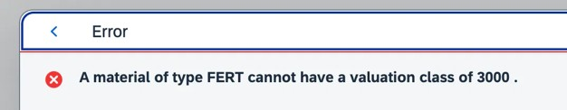
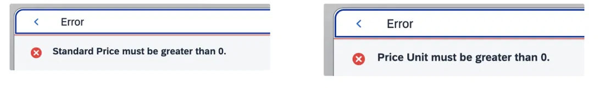

# [01] 자재관리

관련 오브젝트 카탈로그: [`01_material-mgmt`](../reference/01_material-mgmt.md)

**구현 진행 상황**
1. ListPage 화면 – 완성도 100%
2. Object Page 화면 – 완성도 100%

## 1) 최초 설계

- **2.1.1. 기본 구성:** DB Table `ZTB07MARA`(자재마스터)와 `ZTB07MARA_T`(자재마스터 텍스트 테이블)는 FS 배포 이전 팀원들과의 사전 논의를 거쳐 자체적으로 설계를 마친 상태였다. Text Table은 원본 테이블의 UUID를 FK로 가져오고 언어키(SPRAS)를 PK로 추가하는 구조였으며, 자재유형(Mtart)·단위(Meins)·표준가격(Stprs)·가격단위(Peinh)·통화(Waers)·플랜트(Werks)·저장위치(Lgort)·평가클래스(Bklas) 등 핵심 필드도 이미 대부분 반영되어 있었다.
- **2.1.2. 삭제 플래그 및 제품군 논의:** 관리 필드로는 변경금지(Matfi) 외에 삭제 플래그(Deletion Flag)도 함께 두는 구조로 설계하였는데, 이는 삭제 플래그를 모든 마스터 테이블에 공통으로 두기도 했고, 사전에 검토한 PO–GR 관련 자료에서 "변경금지 플래그로 자재를 통제·관리한다"는 내용을 확인했기 때문이다. 또한 SO–GI 관련 SD 테이블을 함께 검토하며 Sales Area 기준 SO/DO 관리를 위해 제품군(Spart) 필드가 필요하다고 판단, 자체적으로 추가해 두었다.

테이블: [`ZTB07MARA`](../reference/01_material-mgmt.md) · [코드 보기](../src/01_material-mgmt/tables/ZTB07MARA.tabl.asddls), [`ZTB07MARA_T`](../reference/01_material-mgmt.md) · [코드 보기](../src/01_material-mgmt/tables/ZTB07MARA_T.tabl.asddls)

## 2) FS 확인 및 비교/분석

FS(01.자재관리_FS) 원문을 확인한 결과, 팀에서 사전 설계한 테이블 구조와 FS가 요구하는 구조가 크게 벗어나지 않았다. Text Table의 PK 구성 방식, 그리고 자재유형·단위·표준가격·가격단위·통화·플랜트·저장위치·평가클래스 등 대부분의 필드가 FS 정의서(2.1)와 사실상 동일하게 매핑되었다.

다만 두 가지 지점에서 최초 설계와의 차이 및 재검토가 있었다.

- **삭제 플래그:** FS 2.1 어디에도 별도의 삭제 플래그는 요구되어 있지 않았다. 이를 계기로 팀원들과 필요성을 재논의하였고, "변경금지(Matfi)만으로도 관리 목적을 충분히 달성할 수 있다"는 의견이 대다수를 차지하여 최종적으로 삭제 플래그 필드는 제외하였다.
- **제품군(Spart):** FS에도 명시적으로 요구되지는 않았으나, 사전 설계 시점의 판단(Sales Area 기반 하위 프로세스 연계 필요성)이 FS 확인 이후에도 여전히 유효하다고 재확인되어, 최종 필드로 유지하였다.

- *최종 DB 테이블 구성 (`ztb07mara`)*

```abap
define table ztb07mara {
  key client  : abap.clnt not null;
  key mat_uuid : abap.raw(16) not null;
  matnr       : zeb07matnr not null;
  mtart       : mtart;
  bklas       : bklas;
  meins       : meins;
  @Semantics.amount.currencyCode : 'ztb07mara.waers'
  stprs       : stprs;
  peinh       : peinh;
  waers       : waers;
  lgort       : lgort_d;
  werks       : werks_d;
  spart       : zeb07spart;
  ersda       : ersda;
  matfi       : matfi;
  include zsb07timestamp;
}
```

- *타임스탬프 Structure (`zsb07timestamp`)*

```abap
@EndUserText.label : 'Time Stamp'
@AbapCatalog.enhancement.category : #NOT_EXTENSIBLE
define structure zsb07timestamp {
  created_by     : syuname;
  creation_at    : timestampl;
  changed_by     : syuname;
  changed_at     : timestampl;
  loc_changed_at : timestampl;
}
```

## 3) TS 수정·보완 내역

### 2.3.1. 제품군 Table Field 추가

자재마스터 사전 설계 단계에서, SO–GI 관련 SD 테이블 설계를 함께 검토하던 중 [Sales Area 기준으로 동작하는] SO/DO 관리를 위해서는 자재마스터에 정보가 필요하다는 결론에 도달하여, 팀 자체 판단으로 제품군(Spart) 추가함. FS 배포 후에도 이 판단이 여전히 유효하다고 재확인되어, FS 2.3 "추가 필드 설명" 항목에 편입시켜 최종 필드로 유지

### 2.3.2. RAP 자재 Page / View 기능 추가 (통화 Waers 동적 제어)

- **적용 Method:** [`get_instance_features (Waers)`](../reference/01_material-mgmt.md) · [코드 보기](../src/01_material-mgmt/bimp/zbp_r_b07_mara.clas.abap)
- **사유:** FS 4.1 "통화는 조회만 되게 설정" 요구사항을 정적 `field(readonly) Waers;`로 구현하려 했으나, Stprs(표준가격)에 지정된 `@Semantics.amount.currencyCode:'Waers'`와 충돌하여 "A static read-only field 'WAERS' is not allowed for an editable amount field" 오류 발생. `field(features:instance) Waers;`로 전환 후, `get_instance_features`에서 항상 `read_only`를 반환하도록 구현하여 FS 요건과 프레임워크 제약을 동시에 충족.

```abap
METHOD get_instance_features.
  READ ENTITIES OF zr_b07_mara IN LOCAL MODE
    ENTITY zr_b07_mara
    FIELDS ( MatUuid )
    WITH CORRESPONDING #( keys )
    RESULT DATA(lt_mara).

  DATA lt_result TYPE TABLE FOR FEATURES RESULT zr_b07_mara.

  LOOP AT lt_mara INTO DATA(ls_mara).
    SELECT SINGLE mat_uuid
      FROM ztb07mara
      WHERE mat_uuid = @ls_mara-MatUuid
      INTO @DATA(lv_dummy).

    DATA(lv_readonly) = COND #( WHEN sy-subrc = 0
                                THEN if_abap_behv=>fc-f-read_only
                                ELSE if_abap_behv=>fc-f-unrestricted ).

    APPEND VALUE #( %tky = ls_mara-%tky
                    %field-Werks = lv_readonly
                    %field-Lgort = lv_readonly
                    %field-Mtart = lv_readonly
                    %field-Bklas = lv_readonly
                    %field-Matnr = lv_readonly
                    %field-Ersda = lv_readonly
                    %field-Waers = if_abap_behv=>fc-f-read_only
                  ) TO lt_result.
  ENDLOOP.

  result = lt_result.
ENDMETHOD.
```

### 2.3.3. RAP 자재 Page 기능 추가 (제품군 Spart 체크 로직)

- **적용 Method:** [`CheckSpart (Validation)`](../reference/01_material-mgmt.md) · [코드 보기](../src/01_material-mgmt/bimp/zbp_r_b07_mara.clas.abap)
- **사유:** 제품군(Spart) 필드를 자재마스터에 추가하면서, 이후 Sales Area를 구성할 때 제품군 필드가 반드시 존재해야만 구성이 가능하다는 점을 파악함. 이에 따라 자재마스터 생성 시점에서부터 (1) 제품군이 입력되어 있는지, (2) 입력된 자재가 해당 제품군 범위에 해당하는지를 미리 검증해 둘 필요가 있다고 판단하여 Validation을 추가함. Spart 필수값 체크 및 자재타입별 허용 제품군 범위 (FERT/HALB→10, HAWA/VERP→20, ROH→20/30, HIBE→30, 그 외→00) 체크를 함께 구현

```abap
METHOD CheckSpart.
  READ ENTITIES OF zr_b07_mara IN LOCAL MODE
    ENTITY zr_b07_mara
    FIELDS ( Mtart Spart )
    WITH CORRESPONDING #( keys )
    RESULT DATA(lt_mara).

  LOOP AT lt_mara INTO DATA(ls_mara).
    " 제품군은 필수값 – 비어있으면 안 됨
    IF ls_mara-Spart IS INITIAL.
      APPEND VALUE #( %tky = ls_mara-%tky ) TO failed-zr_b07_mara.
      APPEND VALUE #( %tky = ls_mara-%tky
                      %element-Spart = if_abap_behv=>mk-on
                      %msg = new_message( id = 'ZMSGE_B07'
                                          number = '015'
                                          v1 = 'Division'
                                          severity = if_abap_behv_message=>severity-error )
                    ) TO reported-zr_b07_mara.
      CONTINUE.
    ENDIF.

    " 자재타입(Mtart)에 맞는 제품군(Spart) 범위인지 체크
    DATA(lv_valid) = abap_false.
    CASE ls_mara-Mtart.
      WHEN 'FERT' OR 'HALB'.
        IF ls_mara-Spart = '10'. lv_valid = abap_true. ENDIF.
      WHEN 'HAWA' OR 'VERP'.
        IF ls_mara-Spart = '20'. lv_valid = abap_true. ENDIF.
      WHEN 'ROH'.
        IF ls_mara-Spart = '20' OR ls_mara-Spart = '30'. lv_valid = abap_true. ENDIF.
      WHEN 'HIBE'.
        IF ls_mara-Spart = '30'. lv_valid = abap_true. ENDIF.
      WHEN OTHERS.
        IF ls_mara-Spart = '00'. lv_valid = abap_true. ENDIF.
    ENDCASE.

    IF lv_valid = abap_false.
      APPEND VALUE #( %tky = ls_mara-%tky ) TO failed-zr_b07_mara.
      APPEND VALUE #( %tky = ls_mara-%tky
                      %element-Spart = if_abap_behv=>mk-on
                      %msg = new_message( id = 'ZMSGE_B07'
                                          number = '021'
                                          v1 = ls_mara-Mtart
                                          v2 = ls_mara-Spart
                                          severity = if_abap_behv_message=>severity-error )
                    ) TO reported-zr_b07_mara.
    ENDIF.
  ENDLOOP.
ENDMETHOD.
```
> 메시지 [`015`](../src/message-class.md#015): "Field &1 is required and cannot be empty." · [`021`](../src/message-class.md#021): "In material type &1, product group &2 cannot be used."


### 2.3.4. RAP 자재 Page / View 기능 추가 (언어 Spras 및 자재명 MaraText 체크 로직)

- **적용 Method:** [`CheckMaraTextExist (Spras)`](../reference/01_material-mgmt.md) · [코드 보기](../src/01_material-mgmt/bimp/zbp_r_b07_mara.clas.abap) · BDEF: [코드 보기](../src/01_material-mgmt/bdef/ZR_B07_MARA.bdef.asbdef)
- **사유:** `ZR_B07_MARA`(Root)와 `ZI_B07_MARATEXT`(Child)의 Composition 관계를 제대로 살리는 것이 핵심이라 판단하여, (1) 사용자가 언어키(Spras)를 편하게 다룰 수 있도록 하고, (2) 자재명(Maktx)이 반드시 입력되도록 체크 로직을 보완.

```abap
CLASS lhc_maratext DEFINITION INHERITING FROM cl_abap_behavior_handler.
  PRIVATE SECTION.
    METHODS CheckMaraTextExist FOR VALIDATE ON SAVE
      IMPORTING keys FOR MaraText~CheckMaraTextExist.
ENDCLASS.

CLASS lhc_maratext IMPLEMENTATION.
  METHOD CheckMaraTextExist.
    READ ENTITIES OF zr_b07_mara IN LOCAL MODE
      ENTITY zr_b07_mara
      BY \_MaraText
      FIELDS ( Spras )
      WITH CORRESPONDING #( keys )
      RESULT DATA(lt_text)
      FAILED DATA(lt_failed_read).

    LOOP AT keys INTO DATA(ls_key).
      READ TABLE lt_text WITH KEY %tky-MatUuid = ls_key-%tky-MatUuid
        TRANSPORTING NO FIELDS.
      IF sy-subrc <> 0.
        APPEND VALUE #( %tky = ls_key-%tky ) TO failed-zr_b07_mara.
        APPEND VALUE #( %tky = ls_key-%tky
                        %msg = new_message( id = 'ZMSGE_B07'
                                            number = '015'
                                            v1 = 'Material Name'
                                            severity = if_abap_behv_message=>severity-error )
                      ) TO reported-zr_b07_mara.
      ENDIF.
    ENDLOOP.
  ENDMETHOD.
ENDCLASS.
```
> 메시지 [`015`](../src/message-class.md#015): "Field &1 is required and cannot be empty."

> 이 체크 로직은 최초에는 `SetLanguageDefault`(Determination on modify)로 Spras를 자동 채우는 방식으로 시도했으나 필수값 제약과 충돌해 실패했고, 이후 목표를 "MaraText 자식 레코드 존재 검증"으로 바꿔 위 Validation으로 정리되었다 — 자세한 경위는 devlog 2026-08-24(작성 예정) 참고.

## 4) 2차 TS 수정·보완 내역 (중간평가 2차)

강사님으로부터 4건의 피드백을 받았다: ① 자재타입-평가클래스 불일치 저장 허용, ② 표준가격 0 저장 허용, ③ 자재 생성 시 자재코드 서치헬프 필요성 의문, ④ 자재명 미입력 저장(의도한 것이면 무관). 이 중 ①~③을 반영하고, ④는 기존 설계 의도(자재명은 위 2.3.4 `CheckMaraTextExist` Validation으로 별도 관리)와 무관한 사안으로 판단해 보류하였다.

### 2.4.1. 자재타입-평가클래스 정합성 검증 강화

- **적용 Method:** [`CheckBklas (확장)`](../reference/01_material-mgmt.md) · [코드 보기](../src/01_material-mgmt/bimp/zbp_r_b07_mara.clas.abap) · BDEF: [코드 보기](../src/01_material-mgmt/bdef/ZR_B07_MARA.bdef.asbdef)
- **사유:** 기존 `CheckBklas`는 평가클래스 값 자체(3000/3300/7900/7920)만 체크하고 자재타입과의 조합은 미검증 상태였음. FS 명세 기준 매핑(FERT→7920, HALB→7900, HAWA/ROH→3000, HIBE/VERP→3300)을 재정리하고, `field Bklas, Mtart`로 검증 범위를 확장해 조합 검증 로직을 추가.

```abap
validation CheckBklas on save { create; update; field Bklas, Mtart; }
```

```abap
" 2026-08-25 신규: 강사 피드백 반영 — 자재타입과 평가클래스 조합이 FS 매핑에 맞는지 체크
IF ( ls_mara-Bklas = '3000' AND ls_mara-Mtart <> 'ROH' AND ls_mara-Mtart <> 'HAWA' )
  OR ( ls_mara-Bklas = '3300' AND ls_mara-Mtart <> 'HIBE' AND ls_mara-Mtart <> 'VERP' )
  OR ( ls_mara-Bklas = '7900' AND ls_mara-Mtart <> 'HALB' )
  OR ( ls_mara-Bklas = '7920' AND ls_mara-Mtart <> 'FERT' ).

  APPEND VALUE #( %tky = ls_mara-%tky ) TO failed-zr_b07_mara.
  APPEND VALUE #( %tky = ls_mara-%tky
                  %element-Bklas = if_abap_behv=>mk-on
                  %msg = new_message( id = 'ZMSGE_B07'
                                      number = '022'
                                      v1 = ls_mara-Mtart
                                      v2 = ls_mara-Bklas
                                      severity = if_abap_behv_message=>severity-error ) )
      TO reported-zr_b07_mara.
ENDIF.
```
> 메시지 [`022`](../src/message-class.md#022)



### 2.4.2. 가격/가격단위 양수 체크

- **적용 Method:** [`CheckPositive (신규)`](../reference/01_material-mgmt.md) · [코드 보기](../src/01_material-mgmt/bimp/zbp_r_b07_mara.clas.abap) · BDEF: [코드 보기](../src/01_material-mgmt/bdef/ZR_B07_MARA.bdef.asbdef)
- **사유:** 강사님은 표준가격(Stprs)만 언급했으나, 가격단위(Peinh)도 0이면 의미가 없다고 판단해 자체적으로 검증 범위를 확장. Stprs>0, Peinh>0을 동시에 검증하며, Prepare 액션에도 등록.

```abap
validation CheckPositive on save { create; update; field Stprs, Peinh; }
```

```abap
METHOD CheckPositive.
  READ ENTITIES OF zr_b07_mara IN LOCAL MODE
    ENTITY zr_b07_mara
    FIELDS ( Stprs Peinh )
    WITH CORRESPONDING #( keys )
    RESULT DATA(lt_mara).

  LOOP AT lt_mara INTO DATA(ls_mara).
    IF ls_mara-Stprs <= 0. "표준 가격은 0보다 커야 한다.
      APPEND VALUE #( %tky = ls_mara-%tky ) TO failed-zr_b07_mara.
      APPEND VALUE #( %tky = ls_mara-%tky
                      %element-Stprs = if_abap_behv=>mk-on
                      %msg = new_message( id = 'ZMSGE_B07'
                                          number = '023'
                                          v1 = 'Standard Price'
                                          severity = if_abap_behv_message=>severity-error ) )
          TO reported-zr_b07_mara.
    ENDIF.

    IF ls_mara-Peinh <= 0. " 가격 단위 역시 1, 2, ... 등 양수가 되어야 한다. (다행히 Peinh가 정수 타입)
      APPEND VALUE #( %tky = ls_mara-%tky ) TO failed-zr_b07_mara.
      APPEND VALUE #( %tky = ls_mara-%tky
                      %element-Peinh = if_abap_behv=>mk-on
                      %msg = new_message( id = 'ZMSGE_B07'
                                          number = '023'
                                          v1 = 'Price Unit'
                                          severity = if_abap_behv_message=>severity-error ) )
          TO reported-zr_b07_mara.
    ENDIF.
  ENDLOOP.
ENDMETHOD.
```
> 메시지 [`023`](../src/message-class.md#023)

표준가격단위(Peinh)는 정수형(Integer) 타입으로 정의되어 있어, 소수점이 포함된 값(예: 0.99)을 입력할 경우 필드 자체 검증 단계에서 "Enter a number without decimals."라는 시스템 오류가 발생하며 입력이 차단된다. 따라서 소수 입력에 대한 별도 예외 처리는 필요하지 않았다.

🧪 테스트: 표준가격이 0 이하인 경우 "Standard Price must be greater than 0.", 표준가격단위가 0 이하인 경우 "Price Unit must be greater than 0." 메시지가 각각 반환되는 것을 확인.


