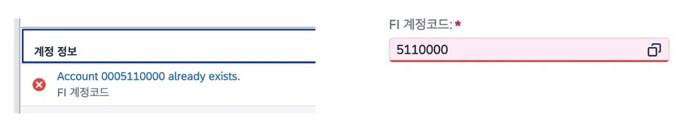
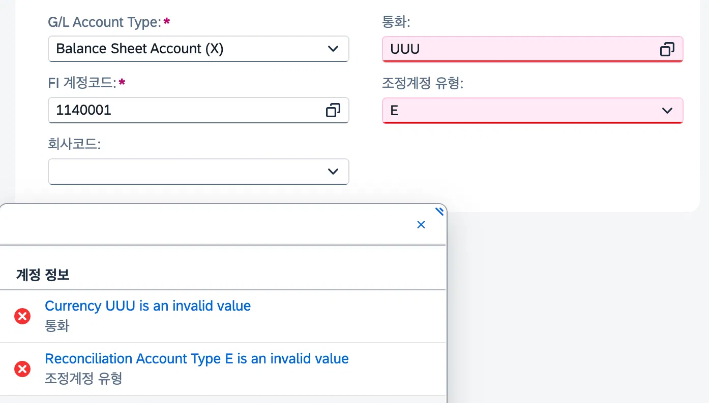

# [02] FI 계정 관리

관련 오브젝트 카탈로그: [`02_fi-account`](../reference/02_fi-account.md)

**구현 진행 상황**
1. ListPage 화면 – 완성도 100%
2. Object Page 화면 – 완성도 100%

## 1) 최초 설계

FI 계정 마스터는 설계 초기 단계부터 별도의 회사코드 마스터 테이블을 두지 않고, 회사코드(Bukrs)를 Fixed Value(FV)로 구성하여 단일 회사코드만 사용하는 방향으로 설계하였다. 계정 텍스트도 별도 테이블 없이 ZTB07SKA1 한 테이블에 계정코드(Saknr)와 계정명(Stext)을 함께 두는 구조였다. 또한 조정계정 구분(Mitkz) 필드를 두어, 공급업체 관련 조정계정 구분값이 입력된 계정은 해당 공급업체에 대한 대금 지급 시에만 사용하도록 관리하려는 목적을 가지고 설계에 반영하였다. 삭제 플래그(Xloev)는 "마스터성 테이블에는 모두 삭제 플래그를 둔다"는 원칙에 따라 포함하였으며, 관리 필드는 로컬 변경시각까지 포함한 5종으로 구성하였다.

## 2) FS 확인 및 비교/분석

FS(02.FI계정관리_FS) 2.1~2.2를 확인한 결과, 팀에서 설계한 내용과 FS가 요구하는 구조가 큰 틀에서는 비슷하였으나 두 가지 차이가 있었다.

- **Text Table 분리:** FS는 `ZTB07SKA1`(Root)과는 별도로 `ZTB07SKA1_T`(UUID + 언어키(Spras)를 PK로 하는 Composition Child) 구조를 요구하고 있었다. 텍스트 테이블을 분리하여 다국어 계정명을 관리하도록 변경하였다.
- **관리 필드 축소:** FI계정관리는 OData V2 기반이며 Draft를 지원하지 않는다(Draft 지원: No). 01.자재관리(V4, Draft O)와 달리 로컬 변경시각(loc_changed_at) 필드가 불필요하다고 판단하여 제외하였다.

- *타임스탬프 Structure (`zsb07timestamp_v2`)*

```abap
@EndUserText.label : 'Time Stamp'
@AbapCatalog.enhancement.category : #NOT_EXTENSIBLE
define structure zsb07timestamp_v2 {
  created_by  : syuname;
  creation_at : timestampl;
  changed_by  : syuname;
  changed_at  : timestampl;
}
```

- *FI 계정 Text Interface Entity* ([`ZI_B07_SKA1TEXT`](../reference/02_fi-account.md) · [코드 보기](../src/02_fi-account/cds/ZI_B07_SKA1TEXT.ddls.asddls))

```abap
@AccessControl.authorizationCheck: #NOT_REQUIRED
@EndUserText.label: 'FI 계정 Text Interface Entity'
@Metadata.ignorePropagatedAnnotations: true
define view entity ZI_B07_SKA1TEXT as select from ztb07ska1_t
association to parent ZR_B07_SKA1 as _Ska1
  on $projection.SakUuid = _Ska1.SakUuid
{
  key sak_uuid as SakUuid,
  key spras as Spras,
  txt20 as Saktx,
  _Ska1 // Make association public
}
```

## 3) TS 수정·보완 내역

### 3.3.1. 테이블 필드 구성 사유

테이블: [`ZTB07SKA1`](../reference/02_fi-account.md) · [코드 보기](../src/02_fi-account/tables/ZTB07SKA1.tabl.asddls), [`ZTB07SKA1_T`](../reference/02_fi-account.md) · [코드 보기](../src/02_fi-account/tables/ZTB07SKA1_T.tabl.asddls)

- **회사코드 (Bukrs):** FS 2.1 최소 필드에는 없으나 실무 필요성으로 1차 설계부터 유지
- **조정계정 구분 (Mitkz):** 표준 도메인 매핑 위해 `I_Reconciliationaccttypetext` 사용
- **계정통화 (Waers) / 삭제 플래그 (Xloev):** 마스터성 테이블 공통 원칙에 따라 유지

### 3.3.2. 텍스트 Association 구성

Root BO: [`ZR_B07_SKA1`](../reference/02_fi-account.md) · [코드 보기](../src/02_fi-account/cds/ZR_B07_SKA1.ddls.asddls)

- **회사코드 (Bukrs) - `I_CompanyCode`:** 계정타입(Glact)에 대한 `_TypeText`(`I_GLAccountTypeText`) Association 추가
- **계정통화 (Waers) - `ZI_B07_WAERS_F4`:** 통화 텍스트 연동 · [코드 보기](../src/00_common-searchhelp/cds/ZI_B07_WAERS_F4.ddls.asddls)
- **조정계정 구분 (Mitkz) - `I_Reconciliationaccttypetext`:** 조정계정 유형 텍스트 연동, 검색 시 `ZI_B07_MITKZ_F4` 활용 · [코드 보기](../src/00_common-searchhelp/cds/ZI_B07_MITKZ_F4.ddls.asddls)

## 4) 2차 TS 수정·보완 내역 (중간평가 2차)

피드백 3건: ① 중복 계정 생성 허용, ② 조정계정유형/회사코드/통화/계정명 미입력 저장(의도한 것이면 무관 → FS 2.1 필드 정의상 원래 필수가 아니므로 보류), ③ 존재하지 않는 회사코드/통화/조정계정유형을 입력해도 저장됨. ①·③을 신규 Validation으로 반영.

### 3.4.1. 계정번호 중복 체크

- **적용 Method:** [`CheckDuplicate (신규)`](../reference/02_fi-account.md) · [코드 보기](../src/02_fi-account/bimp/zbp_r_b07_ska1.clas.abap) · BDEF: [코드 보기](../src/02_fi-account/bdef/ZR_B07_SKA1.bdef.asbdef)
- **사유:** `Saknr`은 `ZEB07SAKNR`(UNIQUE 인덱스)로 정의만 되어 있고 PK는 UUID라, 실제 저장 시 중복 검증이 없던 문제. 04 회계계정결정관리의 `CheckAccountExist` 패턴을 참고해 SELECT → 루프 → READ TABLE 구조로 구현.

```abap
validation CheckDuplicate on save { create; field Saknr; }
```

```abap
METHOD CheckDuplicate.
  READ ENTITIES OF zr_b07_ska1 IN LOCAL MODE
    ENTITY zr_b07_ska1
    FIELDS ( Saknr ) WITH CORRESPONDING #( keys )
    RESULT DATA(lt_ska1).
  SELECT saknr FROM ztb07ska1
      INTO TABLE @DATA(lt_db_saknr). " 중복 확인할 테이블을 미리 담아두기
  LOOP AT lt_ska1 INTO DATA(ls_ska1).
    READ TABLE lt_db_saknr INTO DATA(lv_db_saknr) WITH KEY saknr = ls_ska1-Saknr.
    IF sy-subrc = 0.
      APPEND VALUE #( %tky = ls_ska1-%tky ) TO failed-zr_b07_ska1.
      APPEND VALUE #(   %tky = ls_ska1-%tky
                        %element-Saknr = if_abap_behv=>mk-on
                        %msg = new_message(
                                  id       = 'ZMSGE_B07'
                                  number   = '017'
                                  v1       = 'Account'
                                  v2 = ls_ska1-Saknr
                                  severity = if_abap_behv_message=>severity-error )
                      ) TO reported-zr_b07_ska1.
    ENDIF.
  ENDLOOP.
ENDMETHOD.
```
> 메시지 [`017`](../src/message-class.md#017)

🧪 테스트: 중복 계정번호 저장 시도 시 정상적으로 막히는 것 확인.



### 3.4.2. 회사코드/통화/조정계정유형 존재 검증

- **적용 Method:** [`CheckExist (신규)`](../reference/02_fi-account.md) · [코드 보기](../src/02_fi-account/bimp/zbp_r_b07_ska1.clas.abap) · BDEF: [코드 보기](../src/02_fi-account/bdef/ZR_B07_SKA1.bdef.asbdef)
- **사유:** F4 Help가 있어도 사용자가 직접 문자열을 입력하면 막지 못한다는 점을 재확인. T001/TCURC/`ZI_B07_MITKZ_F4`를 각각 조회 후, 값이 입력된 경우에만 실존 여부를 검증(미입력은 별도 사양이라 통과). `TRANSPORTING NO FIELDS` + `sy-subrc <> 0`로 최종 리팩터링.

```abap
validation CheckExist on save { create; update; field Bukrs, Waers, Mitkz; }
```

```abap
METHOD CheckExist.
  READ ENTITIES OF zr_b07_ska1 IN LOCAL MODE
    ENTITY zr_b07_ska1
    FIELDS ( Bukrs Waers Mitkz ) WITH CORRESPONDING #( keys )
    RESULT DATA(lt_ska1).

  SELECT bukrs FROM t001
      INTO TABLE @DATA(lt_db_bukrs). " T001에 담긴 회사코드인지 확인할 용도로 미리 조회 (K200)
  SELECT waers FROM tcurc
      INTO TABLE @DATA(lt_db_waers). " 마찬가지로 원본 테이블 tcurc 데이터 확인용으로 미리 조회
  SELECT mitkz FROM zi_b07_mitkz_f4
      INTO TABLE @DATA(lt_db_mitkz). " 직접 만든 서치헬프용으로 5개 값만 미리 담기

  LOOP AT lt_ska1 INTO DATA(ls_ska1).
    READ TABLE lt_db_bukrs TRANSPORTING NO FIELDS WITH KEY bukrs = ls_ska1-Bukrs.
    IF sy-subrc <> 0 AND ls_ska1-Bukrs IS NOT INITIAL. " 회사코드를 입력한 경우에만 값 검증!
      APPEND VALUE #( %tky = ls_ska1-%tky ) TO failed-zr_b07_ska1.
      APPEND VALUE #(   %tky = ls_ska1-%tky
                        %element-Bukrs = if_abap_behv=>mk-on
                        %msg = new_message(
                                  id       = 'ZMSGE_B07'
                                  number   = '019'
                                  v1       = 'Company Code'
                                  v2 = ls_ska1-Bukrs
                                  severity = if_abap_behv_message=>severity-error )
                      ) TO reported-zr_b07_ska1.
    ENDIF.

    READ TABLE lt_db_waers TRANSPORTING NO FIELDS WITH KEY waers = ls_ska1-Waers.
    IF sy-subrc <> 0 AND ls_ska1-Waers IS NOT INITIAL. " 통화키를 입력한 경우에만 값 검증!
      APPEND VALUE #( %tky = ls_ska1-%tky ) TO failed-zr_b07_ska1.
      APPEND VALUE #(   %tky = ls_ska1-%tky
                        %element-Waers = if_abap_behv=>mk-on
                        %msg = new_message(
                                  id       = 'ZMSGE_B07'
                                  number   = '019'
                                  v1       = 'Currency'
                                  v2 = ls_ska1-Waers
                                  severity = if_abap_behv_message=>severity-error )
                      ) TO reported-zr_b07_ska1.
    ENDIF.

    READ TABLE lt_db_mitkz TRANSPORTING NO FIELDS WITH KEY mitkz = ls_ska1-Mitkz.
    IF sy-subrc <> 0 AND ls_ska1-Mitkz IS NOT INITIAL. " 값을 입력한 경우에만 검증할 수 있도록 하기!
      APPEND VALUE #( %tky = ls_ska1-%tky ) TO failed-zr_b07_ska1.
      APPEND VALUE #(   %tky = ls_ska1-%tky
                        %element-Mitkz = if_abap_behv=>mk-on
                        %msg = new_message(
                                  id       = 'ZMSGE_B07'
                                  number   = '019'
                                  v1       = 'Reconciliation Account Type'
                                  v2 = ls_ska1-Mitkz
                                  severity = if_abap_behv_message=>severity-error )
                      ) TO reported-zr_b07_ska1.
    ENDIF.
  ENDLOOP.
ENDMETHOD.
```
> 메시지 [`019`](../src/message-class.md#019)

🧪 테스트: 회사코드/통화/조정계정유형 각각 이상한 값을 넣었을 때 해당 필드만 개별로 에러가 뜨고, 값이 비어있으면(입력 안 한 경우) 검증을 건너뛰는 것 확인. 통화+조정계정유형 2개 필드를 동시에 틀리게 입력한 경우에도 각 필드별 에러 메시지가 개별로 표시되는 것을 확인.


