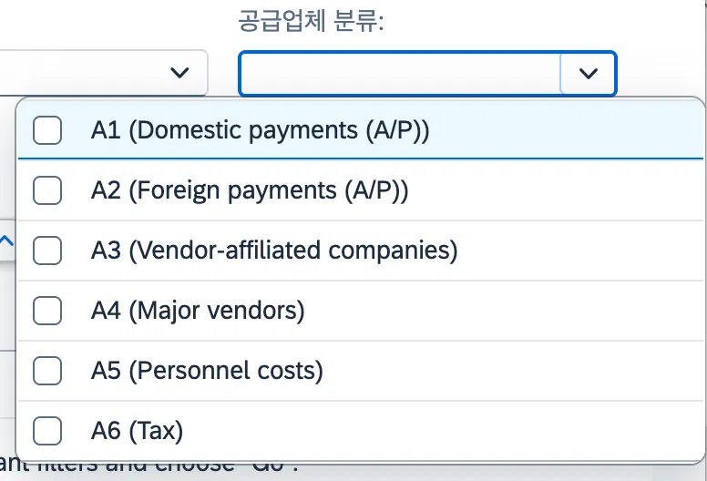
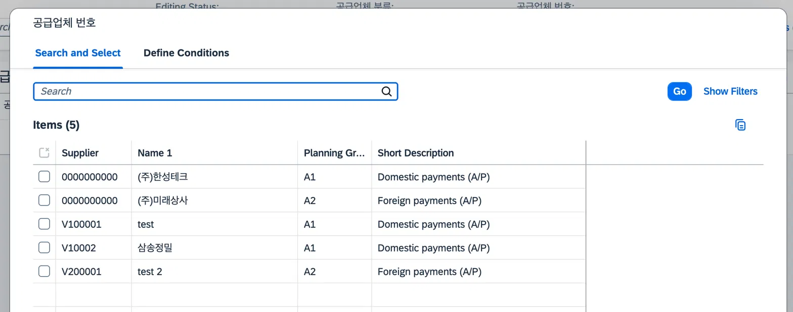
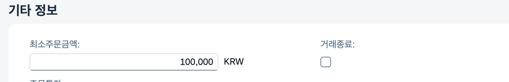
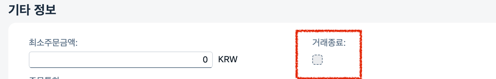

# [03] 벤더관리

관련 오브젝트 카탈로그: [`03_vendor`](../reference/03_vendor.md)

**구현 진행 상황**
1. ListPage 화면 – 완성도 100%
2. Object Page 화면 – 완성도 100%

## 1) 최초 설계

Fiori "BP(Business Partner) 관리" 구조를 참고하여 BP 마스터(공통)-벤더 마스터-커스터머 마스터 3계층 구조로 설계를 채택함.

- **BP 통합 마스터:** 국가키, 도시, 주소, 사업자번호 등 순수 공통 기본정보 관리
- **공급업체 마스터:** BP 마스터 참조(FK), 공급업체 분류(A1: 국내지급 등), 구매조직(Ekorg), 구매그룹(Ekgrp), 조정계정(Akont) 반영
- **고객 마스터:** 영업조직(Vkorg), 유통채널(Vtweg), 제품군(Spart) 반영

## 2) FS 확인 및 비교/분석

FS(03.밴더관리_FS)는 공급업체(`ZTB07LFA1`) 단일 테이블 구성을 전제함.

- **테이블 구조 단순화:** BP-벤더-고객 3계층 구조 대신 FS 요건에 따라 공급업체·고객을 각각 독립된 단일 테이블로 단순화.
- **채번 로직 개선:** FS 4.2 분류별 넘버레인지 분리 요건 충족을 위해 `NUMBER_GET_NEXT` FM을 활용하되, 채번 결과 뒤 6자리를 추출하여 접두어 'V'를 코드 레벨에서 붙이는 방식(V+6자리)을 적용.
- **Association 확장:** Akont(조정계정) 필드에 `ZR_B07_SKA1` Association을 연결하여 계정명/계정타입까지 노출하도록 확장.

테이블: [`ZTB07LFA1`](../reference/03_vendor.md) · [코드 보기](../src/03_vendor/tables/ZTB07LFA1.tabl.asddls)

## 3) TS 수정·보완 내역

### 4.3.1. 테이블 필드 추가/수정

- **구매조직 (Ekorg) / 구매그룹 (Ekgrp):** 실무 필요성에 따라 유지
- **거래상태 (Loevm):** 단순 삭제 플래그가 아닌 실제 거래 종료(중지) 여부 관리 목적으로 반영

### 4.3.2. RAP 공급업체 코드(Lifnr) Determination 로직 추가

- **Method:** [`SetVendorNumber(Lifnr)`](../reference/03_vendor.md) · [코드 보기](../src/03_vendor/bimp/zbp_r_b07_lfa1.clas.abap)
- **사유:** 분류(Fdgrv)별로 V + 6자리 숫자(예: A1 분류 → V100001) 형태의 공급업체 번호를 채번. 예외 케이스(WHEN OTHERS)는 기본 레인지(01)로 폴백 처리.

### 4.3.3. RAP 조정계정(Akont) Validation 체크 로직 추가

- **Method:** [`CheckAccountExist(Akont)`](../reference/03_vendor.md) · [코드 보기](../src/03_vendor/bimp/zbp_r_b07_lfa1.clas.abap)
- **사유:** 입력된 Akont가 실제 `ZTB07SKA1`에 존재하는 계정인지 검증.

### 4.3.4. Association 구성

Root BO: [`ZR_B07_LFA1`](../reference/03_vendor.md) · [코드 보기](../src/03_vendor/cds/ZR_B07_LFA1.ddls.asddls)

- **조정계정 (Akont) & 계정 타입 (Glact) - `ZR_B07_SKA1`:** 조정계정 코드에 계정명(`Akontxt`)과 계정타입(`Glact`/`Glactxt`)까지 함께 끌어와 Object Page "계정 정보" Facet에서 노출하도록 MDE 확장.

> 공급업체 자체 서치헬프(`ZI_B07_LFA1_F4`)는 아직 src에 반영되지 않은 상태다(잔여 이슈 — [`07_remaining-issues.md`](./07_remaining-issues.md) 참고).

## 4) 2차 TS 수정·보완 내역 (중간평가 2차)

피드백 4건: ① 공급업체/계정 Value Help 필요, ② 구매정보 구매조직 필드 라벨 중복, ③ 신규 생성 시 거래종료 옵션 필요성 의문, ④ 계정/구매조직/최소주문금액 미입력 저장(의도한 것이면 무관 → 보류). ①~③을 반영.

### 4.4.1. Value Help 3종 연결

1차 TS 잔여 이슈("공급업체 Lifnr 서치헬프 1개 미완료")에 대응하는 작업이기도 하다. 공급업체 분류(Fdgrv)·공급업체 코드(Lifnr)·계정(Akont) 모두 서치헬프 자체는 이미 만들어져 있었는데, Projection View에 연결이 안 되어 있던 것을 확인했다.

- **공급업체 분류(Fdgrv):** 기존 `zi_b07_fdgrv_f4` 연결(이미 구현되어 있던 서치헬프 적용)
- **공급업체 코드(Lifnr):** 새 서치헬프 [`ZI_B07_LIFNR_F4`](../reference/00_common-searchhelp.md) 신규 생성 후 연결 · [코드 보기](../src/00_common-searchhelp/cds/ZI_B07_LIFNR_F4.ddls.asddls) — `ZR_B07_LFA1` 기반, 공급업체번호/공급업체명/분류/분류설명 노출
- **계정(Akont):** 기존 `zi_b07_saknr_f4` 연결

관련 오브젝트: [`ZC_B07_LFA1`](../reference/03_vendor.md) · [코드 보기](../src/03_vendor/cds/ZC_B07_LFA1.ddls.asddls)
```abap
/********* 공급업체 분류 ************/
@UI.selectionField: [{  position: 10  }]
@ObjectModel.text.element: ['Fdgxt']
@UI.textArrangement: #TEXT_FIRST
@Consumption.valueHelpDefinition: [{ entity: { name: 'ZI_B07_FDGRV_F4', element: 'Fdgrv' } }]
Fdgrv,
Fdgxt,

/********* 공급업체 번호 ************/
@Search.defaultSearchElement: true
@Search.fuzzinessThreshold: 0.8
@UI.selectionField: [{  position: 20  }]
@ObjectModel.text.element: ['Name1']
@UI.textArrangement: #TEXT_FIRST
@Consumption.valueHelpDefinition: [{ entity: { name: 'ZI_B07_LIFNR_F4', element: 'Lifnr' } }]
Lifnr,
Name1,

/*********   조정계정   ************/
@Search.defaultSearchElement: true
@Search.fuzzinessThreshold: 0.8
@ObjectModel.text.element: ['Akontxt']
@UI.textArrangement: #TEXT_FIRST
@Consumption.valueHelpDefinition: [{ entity: { name: 'ZI_B07_SAKNR_F4', element: 'Saknr' } }]
Akont,
Akontxt,
```

🧪 테스트: 3개 필드 모두 F4 정상 동작 확인.





### 4.4.2. 구매조직/구매그룹 라벨 중복 수정

MDE에서 `Ekorg`, `Ekgrp` 두 필드의 `label`이 둘 다 '구매조직'으로 동일하게 되어 있던 것을 확인(Ekorg 어노테이션을 복사하다 생긴 문제로 추정). `Ekgrp` 쪽 라벨을 '구매그룹'으로 수정.

관련 오브젝트: [`ZC_B07_LFA1`](../reference/03_vendor.md) MDE · [코드 보기](../src/03_vendor/cds/ZC_B07_LFA1.ddlx.asddlx)
```abap
@UI.identification: [ { qualifier: 'PurchaseInfo', position: 10, label: '구매조직' } ]
Ekorg;
@UI.identification: [ { qualifier: 'PurchaseInfo', position: 20, label: '구매그룹' } ]
Ekgrp;
```

수정 전(둘 다 '구매조직'으로 표시)과 수정 후(각각 '구매조직'/'구매그룹'으로 분리) 화면 비교:


### 4.4.3. 신규 생성 시 거래종료(Loevm) 편집 불가 처리

신규 벤더를 만들자마자 "거래 종료"로 체크할 수 있는 게 로직상 이상하다는 피드백. 01 자재관리에서 정립한 동적 Feature Control 패턴을 재적용 — 생성 시에는 `Loevm`을 read only 처리하고, 수정(Update) 시에만 편집 가능하도록 구현.

- **적용 Method:** [`get_instance_features (Loevm)`](../reference/03_vendor.md) · [코드 보기](../src/03_vendor/bimp/zbp_r_b07_lfa1.clas.abap) · BDEF: [코드 보기](../src/03_vendor/bdef/ZR_B07_LFA1.bdef.asbdef)

```abap
field ( features : instance ) Loevm;
```

```abap
METHOD get_instance_features.
  DATA lt_result TYPE TABLE FOR FEATURES RESULT zr_b07_lfa1.
  READ ENTITIES OF zr_b07_lfa1 IN LOCAL MODE
    ENTITY zr_b07_lfa1
    FIELDS ( LifUuid )
    WITH CORRESPONDING #( keys )
    RESULT DATA(lt_lfa1).
  SELECT lif_uuid FROM ztb07lfa1
      INTO TABLE @DATA(lt_dummy)." 미리 DB 테이블 데이터를 받아놓고
  LOOP AT lt_lfa1 INTO DATA(ls_lfa1). " Uuid(=PK) 기준으로 겹치는 데이터가 있다면 기존 벤더 수정중!
  READ TABLE lt_dummy INTO DATA(lv_dummy) WITH KEY lif_uuid = ls_lfa1-LifUuid.
    " 조회 성공 = 기존 벤더(Update) = 거래종료 편집 가능
    " 조회 실패 = 신규 생성 중(Create) = 거래종료 readonly
    DATA(lv_readonly) = COND #( WHEN sy-subrc = 0
                                 THEN if_abap_behv=>fc-f-unrestricted
                                 ELSE if_abap_behv=>fc-f-read_only ).
    APPEND VALUE #( %tky         = ls_lfa1-%tky
                     %field-Loevm = lv_readonly ) TO lt_result.
  ENDLOOP.
  result = lt_result.
ENDMETHOD.
```

🧪 테스트: Edit(수정)으로 들어갔을 땐 체크박스가 열려있고, 새로 Create한 경우엔 회색(선택 불가)으로 나오는 것 확인.




