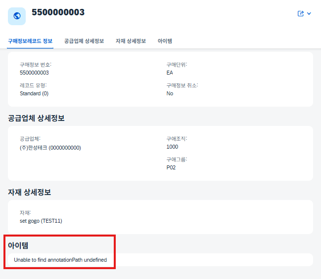
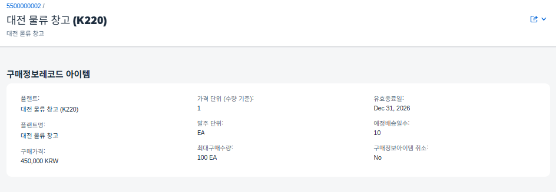

# [05] 구매정보레코드관리

관련 오브젝트 카탈로그: [`05_purchase-info`](../reference/05_purchase-info.md)

**구현 진행 상황**
1. 헤더(EINA) — 기본값/채번/검증 로직 작성 완료, 예외 처리·전체 검증 테스트는 WIP
2. 아이템(EINE) — 기본값/검증 로직 작성 완료, 예외 처리·전체 검증 테스트는 WIP

## 1) 최초 설계

공급업체·자재를 플랜트별로 조합해 구매가격/최대구매수량/예정배송일수/유효종료일을 관리하는 Purchasing Info Record 기능. 01~04와 달리, 헤더(EINA)도 아이템(EINE)처럼 Interface View를 거쳐 Root로 올라가는 구조를 신규로 채택했다.

```
ZTB07EINA (헤더 테이블)  →  ZI_B07_EINA (헤더 Interface View)  ┐
                                                                ├→ ZR_B07_EINA (Root BO View, Composition으로 결합)
ZTB07EINE (아이템 테이블) →  ZI_B07_EINE (아이템 Interface View) ┘
```

## 2) TS 수정·보완 내역

### 6.2.1. 레코드유형, 가격단위/발주단위, 구매조직/구매그룹 — 신규 Field 추가

FS 2.1 테이블 정의서에는 없지만, FS의 다른 요구사항을 충족하기 위해 필요하다고 판단해 팀이 자체적으로 추가한 필드 5종.

| Field | 변경/추가 이유 |
| --- | --- |
| `Esokz`(레코드유형) | FS 3.3이 "구매정보 레코드타입명 등 필요한 Association 추가"를 요구하지만, 정작 FS 2.1 테이블 정의서에는 레코드유형 코드 필드 자체가 없다는 걸 확인. 텍스트 Association을 구성하려면 참조할 코드 필드가 먼저 있어야 하므로 자체 판단으로 `Esokz`를 신규 추가하고, 이후 `I_Domain*` 기반 텍스트 Association을 이어서 구성하기로 계획 |
| `Ekorg`(구매조직) | 구매정보 레코드는 "어느 구매조직·구매그룹이 이 공급업체-자재 조합을 담당하는지"까지 관리 대상이라고 판단해 추가. 03.벤더관리에서 이미 동일한 목적으로 도입한 필드이나, 05는 헤더(EINA) 레벨에서 별도로 관리해야 하는 정보라 벤더 테이블 필드를 그대로 참조하지 않고 05 자체 필드로 새로 구현 |
| `Ekgrp`(구매그룹) | 위 `Ekorg`와 동일한 맥락 |
| `Peinh`(가격단위) | FS가 요구한 구매가격(`Netpr`)만으로는 "몇 개당 얼마"인지 알 수 없어 실제 단가 계산이 불가능하다고 판단, `Peinh`를 추가해 `Netpr÷Peinh`로 `Bprme` 1개당 단가를 산출하도록 설계 |
| `Bprme`(발주단위) | 실제 발주 시 사용하는 단위(EA/KG/BOX 등)를 별도로 관리해야 최대구매수량(`Bstma`) 등 후속 필드와 단위 기준을 일관되게 맞출 수 있다고 판단해 `Peinh`와 함께 추가 |

관련 오브젝트: [`ZTB07EINA`](../reference/05_purchase-info.md), [`ZTB07EINE`](../reference/05_purchase-info.md) · [코드 보기(헤더)](../src/05_purchase-info/tables/ZTB07EINA.tabl.asddls), [코드 보기(아이템)](../src/05_purchase-info/tables/ZTB07EINE.tabl.asddls)

화면 반영 확인:





> 🐛 위 첫 번째 화면에는 "아이템" Facet에서 `Unable to find annotationPath undefined` 오류가 함께 캡처되어 있다. 아이템 MDE와 Facet/헤더 인포 어노테이션을 모두 갖춰놓고도 뜨지 않아 원인을 찾아본 결과, Service Definition(`ZUI_B07_EINA`)에서 아이템(`ZC_B07_EINE`)까지 expose하지 않은 게 원인이었다. `expose ZC_B07_EINE;` 추가로 해결 완료 — 현재 소스([코드 보기](../src/05_purchase-info/srv/ZUI_B07_EINA.srvd.asddls))에는 반영되어 있다.

### 6.2.2. 동일 공급업체 + 자재 조합 중복 방지 체크 로직 추가 — `CheckDuplicate`

FS의 "공급업체, 자재 관련 필요 체크 로직 구현"이라는 열린 지시를 팀이 "동일 공급업체+자재 조합 중복 방지"로 구체화하여 구현.

- **Method:** [`CheckDuplicate`](../reference/05_purchase-info.md) · [코드 보기](../src/05_purchase-info/bimp/zbp_r_b07_eina.clas.abap)

```abap
METHOD CheckDuplicate.
  READ ENTITIES OF zr_b07_eina IN LOCAL MODE
    ENTITY zr_b07_eina
      FIELDS ( LifUuid MatUuid )
      WITH CORRESPONDING #( keys )
    RESULT DATA(lt_eina).
  SELECT inf_uuid, lif_uuid, mat_uuid FROM ztb07eina
    INTO TABLE @DATA(lt_db_data).
  LOOP AT lt_eina INTO DATA(ls_eina)
       WHERE LifUuid IS NOT INITIAL AND MatUuid IS NOT INITIAL.
    DATA(lv_is_dup) = abap_false.
    LOOP AT lt_db_data INTO DATA(ls_db_data)
         WHERE lif_uuid = ls_eina-LifUuid
           AND mat_uuid = ls_eina-MatUuid
           AND inf_uuid <> ls_eina-InfUuid.
      lv_is_dup = abap_true.
      EXIT.
    ENDLOOP.
    IF lv_is_dup = abap_true.
      APPEND VALUE #( %tky = ls_eina-%tky ) TO failed-zr_b07_eina.
      APPEND VALUE #( %tky = ls_eina-%tky
                       %msg = new_message( id = 'ZMSGE_B07'
                                            number   = '017'
                                            v1       = 'Purchase Info Record'
                                            v2       = 'Vendor/Material'
                                            severity = if_abap_behv_message=>severity-error ) )
        TO reported-zr_b07_eina.
    ENDIF.
  ENDLOOP.
ENDMETHOD.
```

### 6.2.3. 구매조직/구매그룹 자동 설정 — `SetDefaults`

`Ekorg`/`Ekgrp` 자체가 FS 2.1에 없는 팀 자체 추가 필드이므로, 이 필드에 대한 자동설정 로직 자체가 전부 신규다. 공급업체 마스터(03.벤더관리, `ZTB07LFA1`) 값을 기준으로 자동 설정하도록 구현.

- **Method:** [`SetDefaults`](../reference/05_purchase-info.md) · [코드 보기](../src/05_purchase-info/bimp/zbp_r_b07_eina.clas.abap)

```abap
METHOD SetDefaults.
  DATA: lt_update TYPE TABLE FOR UPDATE zr_b07_eina.
  READ ENTITIES OF zr_b07_eina IN LOCAL MODE
    ENTITY zr_b07_eina
      FIELDS ( Esokz LifUuid Ekorg Ekgrp )
      WITH CORRESPONDING #( keys )
    RESULT DATA(lt_eina).
  SELECT lif_uuid, ekorg, ekgrp FROM ztb07lfa1
    INTO TABLE @DATA(lt_db_lfa1).
  LOOP AT lt_eina INTO DATA(ls_eina)
       WHERE Esokz IS INITIAL OR Ekorg IS INITIAL OR Ekgrp IS INITIAL.
    READ TABLE lt_db_lfa1 INTO DATA(ls_db_lfa1) WITH KEY lif_uuid = ls_eina-LifUuid.
    APPEND VALUE #( %tky  = ls_eina-%tky
                     Esokz = COND #( WHEN ls_eina-Esokz IS INITIAL THEN '0' ELSE ls_eina-Esokz )
                     Ekorg = COND #( WHEN ls_eina-Ekorg IS INITIAL THEN ls_db_lfa1-ekorg ELSE ls_eina-Ekorg )
                     Ekgrp = COND #( WHEN ls_eina-Ekgrp IS INITIAL THEN ls_db_lfa1-ekgrp ELSE ls_eina-Ekgrp )
                   ) TO lt_update.
  ENDLOOP.
  IF lt_update IS NOT INITIAL.
    MODIFY ENTITIES OF zr_b07_eina IN LOCAL MODE
      ENTITY zr_b07_eina
        UPDATE FIELDS ( Esokz Ekorg Ekgrp )
        WITH lt_update.
  ENDIF.
ENDMETHOD.
```

> 위 코드는 `Esokz`(레코드유형) 기본값 `'0'` 설정도 같은 메서드에서 함께 처리한다 — `Esokz`는 6.2.1에서 신규 추가한 필드, `Ekorg`/`Ekgrp` 자동설정이 이번 항목의 핵심.

### 6.2.4. 레코드유형 값 제한 — `CheckEsokz`

`Esokz`도 FS 2.1에 없는 신규 필드라 이 필드의 값 검증 로직 자체가 신규다. 현재는 `'0'` 외 값이면 에러 처리, 향후 확장 예정.

- **Method:** [`CheckEsokz`](../reference/05_purchase-info.md) · [코드 보기](../src/05_purchase-info/bimp/zbp_r_b07_eina.clas.abap)

```abap
METHOD CheckEsokz.
  READ ENTITIES OF zr_b07_eina IN LOCAL MODE
    ENTITY zr_b07_eina
      FIELDS ( Esokz )
      WITH CORRESPONDING #( keys )
    RESULT DATA(lt_eina).
  LOOP AT lt_eina INTO DATA(ls_eina) WHERE Esokz IS NOT INITIAL AND Esokz <> '0'.
    APPEND VALUE #( %tky = ls_eina-%tky ) TO failed-zr_b07_eina.
    APPEND VALUE #( %tky = ls_eina-%tky
                     %element-Esokz = if_abap_behv=>mk-on
                     %msg = new_message( id = 'ZMSGE_B07'
                                          number   = '021'
                                          v1       = 'Purchase Info Category'
                                          v2       = ls_eina-Esokz
                                          severity = if_abap_behv_message=>severity-error ) )
      TO reported-zr_b07_eina.
  ENDLOOP.
ENDMETHOD.
```

> ⚠️ 메시지 [021](../src/message-class.md#021)은 원래 01번 자재관리(`In material type &1, product group &2 cannot be used.`)에서 만든 문구라, 여기서 재사용하면 실제 화면 문구가 "In material type Purchase Info Category, product group 0 cannot be used." 처럼 의미가 맞지 않게 표시된다. 코드는 원문 그대로 옮겼고 임의로 고치지 않았으니, 전용 메시지 번호 신규 채번이 필요한지 확인 바람.

### 6.2.5. 아이템 플랜트 존재 검증 — `CheckExist`

FS의 "공급업체, 자재 관련 필요 체크 로직 구현" 지시를 팀이 "플랜트(Werks)가 실제 존재하는 값인지 검증"으로 구체화 — `ZI_B07_WERKS_F4` 대상으로 존재 여부 확인.

- **Method:** [`CheckExist`](../reference/05_purchase-info.md) · [코드 보기](../src/05_purchase-info/bimp/zbp_r_b07_eina.clas.abap)

```abap
METHOD CheckExist.
  READ ENTITIES OF zr_b07_eina IN LOCAL MODE
    ENTITY zr_b07_eina
    BY \_Eine
    FIELDS ( Werks )
    WITH CORRESPONDING #( keys )
    RESULT DATA(lt_eine)
    FAILED DATA(lt_failed_read).
  SELECT plant FROM zi_b07_werks_f4
    INTO TABLE @DATA(lt_db_werks).
  LOOP AT lt_eine INTO DATA(ls_eine) WHERE Werks IS NOT INITIAL.
    READ TABLE lt_db_werks INTO DATA(lv_db_werks) WITH KEY plant = ls_eine-Werks.
    IF sy-subrc <> 0.
      APPEND VALUE #( %tky = ls_eine-%tky ) TO failed-eine.
      APPEND VALUE #( %tky = ls_eine-%tky
                       %element-Werks = if_abap_behv=>mk-on
                       %msg = new_message( id = 'ZMSGE_B07'
                                            number   = '020'
                                            v1       = 'Plant'
                                            v2       = ls_eine-Werks
                                            severity = if_abap_behv_message=>severity-error ) )
        TO reported-eine.
    ENDIF.
  ENDLOOP.
ENDMETHOD.
```

> ⚠️ 메시지 [020](../src/message-class.md#020)도 원래 02번(`&1 &2 is not a real account.`, 계정 전용 문구)에서 만든 것을 재사용한 케이스라 "Plant XXXX is not a real account."처럼 부자연스럽게 표시된다. 마찬가지로 코드는 그대로 두고 여기 남겨둠.

## 테스트 현황

8/31·9/1 개발일지 기준, 위 로직들을 화면에서 개별적으로 확인해보는 테스트는 아직 완료되지 않은 상태다(기본값 자동 채움 정도만 확인됨). 서치헬프로 공급업체/자재를 선택해도 저장 시 "Field Vendor/Material is required and cannot be empty."로 막히는 별도 이슈가 진행 중이라, 이 문제부터 해결한 뒤 각 로직의 화면 테스트를 마무리하는 게 순서상 맞을 것 같다.

관련 Search Help: [`ZI_B07_WERKS_F4`](./00_common.md), 공급업체는 [벤더관리](./03_vendor.md), 자재는 [자재관리](./01_materialmgmt.md) 참조
